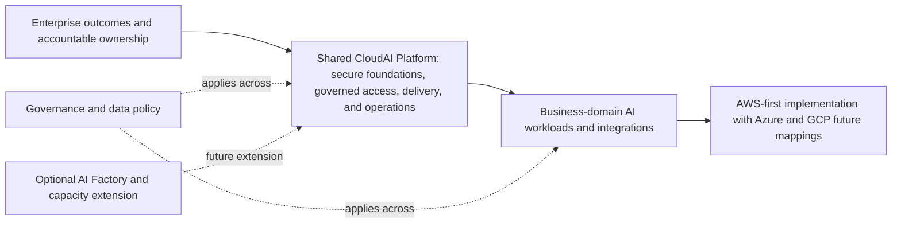

# Cloud & AI Platform Engineering Portfolio

## Yvonne Yao — Senior Platform Engineer — Cloud & AI

I design and build secure, governed, observable, and cost-aware cloud and platform foundations for AI workloads and AI-assisted engineering. This personal portfolio explores reusable, mock-first patterns for enterprise environments through AWS platform infrastructure, delivery automation, and controlled AI access.

[LinkedIn](https://www.linkedin.com/in/yvonneyao/) · [GitHub](https://github.com/afaryy)

**Core technologies:** AWS · Terraform · Kubernetes · EKS · Helm · Argo CD · GitHub Actions · TypeScript · Python · JSON Schema · AI governance patterns

> **Public-safe note:** This personal technical portfolio uses synthetic data, generic identifiers, and public cloud service patterns; mock mode remains the default. It intentionally excludes employer, customer, confidential, credential, and proprietary information.

## Architecture at a Glance



This is a reference architecture, not a deployed topology. Read the
[full architecture hierarchy](docs/architecture.md) for the enterprise
capability map, CloudAI platform domains, lifecycle, evidence boundaries, and
provider views.

## Featured Solutions

| Solution | Status | Focus |
| --- | --- | --- |
| [Governed AI Gateway](docs/featured-solutions.md#governed-ai-gateway) | **Implemented — mock-first** | Controlled model access, request policy, metadata-only evidence, and an opt-in provider adapter boundary. |
| [AI Release Engineering on EKS](docs/featured-solutions.md#ai-release-engineering-on-eks) | **Implemented — sandbox-validated** | Terraform, Helm, GitOps, rollout, rollback, and teardown discipline for a synthetic workload. |
| [Governed RAG Lifecycle](docs/featured-solutions.md#governed-rag-lifecycle) | **Implemented — local synthetic workflow** | Provenance, source lifecycle, evaluation artifacts, and deterministic local quality checks. |
| [Bounded Bedrock Sandbox](docs/featured-solutions.md#bounded-bedrock-sandbox) | **Implemented — bounded synthetic sandbox validation** | Short-lived identity, least-privilege access, manual approval, and narrow synthetic Guardrail checks. |

[Read the featured-solution evidence and boundaries →](docs/featured-solutions.md)

### Evidence-Status Legend

- **Implemented — mock-first:** local code, contracts, and tests are present;
  no provider call is required by default.
- **Implemented — local synthetic workflow:** local, synthetic artifacts and
  deterministic checks demonstrate the workflow without a hosted runtime.
- **Implemented — sandbox-validated:** a manually approved personal sandbox
  validation exercised a synthetic workload; it is not a production platform.
- **Implemented — bounded synthetic sandbox validation:** a manually approved,
  least-privilege provider validation used synthetic inputs and sanitized
  evidence; it is not unconstrained provider access or production operation.
- **Design / future reference:** an architecture mapping or documented boundary
  without runtime implementation evidence.

## What This Portfolio Demonstrates

- Cloud platform foundations, infrastructure-as-code, and controlled delivery paths.
- Governed AI access, RAG lifecycle controls, safety boundaries, and evaluation evidence.
- Kubernetes packaging, GitOps, rollout and rollback patterns, and cost-aware sandbox discipline.
- Explicit separation between implemented, mock-first, sandbox-validated, and future work.

## Architecture Library

[Browse the complete Architecture Library →](docs/architecture-library.md)

## Repository Boundaries

The Technical Reference below links to the implementation record and evidence
boundaries. This repository does not claim production operation, customer-data
use, autonomous agent execution, or a general-purpose AI application.

---

## Technical Reference

The portfolio landing page above is deliberately concise. Use these paths for
the supporting technical detail:

- [Architecture library](docs/architecture-library.md) — complete curated
  document index, including AWS-first and future Azure/GCP mappings.
- [Architecture hierarchy](docs/architecture.md) — enterprise ecosystem,
  capability layers, CloudAI domains, lifecycle, and evidence boundaries.
- [Solution walkthrough](docs/cloudai-platform-solution-walkthrough.md) —
  guided technical reading sequence and evidence progression.
- [Current status](docs/current-status.md) — implementation record, bounded
  sandbox validation, deferred scope, and recommended next slice.
- [Featured solutions](docs/featured-solutions.md) — four case studies with
  technical evidence, trade-offs, and explicit non-claims.

AWS is the first provider with bounded implementation and validation evidence.
Azure and GCP remain reference mappings, not provider-parity implementations.
AgentCore, AI Factory, and GPU capacity patterns remain future design scope.

## Run Locally in Mock Mode

The current P1 implementation runs locally in mock mode.

The P1 mock GenAI API uses local synthetic responses:

```bash
cd providers/aws/app/api
pnpm install
pnpm run build
pnpm test
pnpm run dev
```

The API exposes:

- `GET /health`
- `POST /chat`
- `GET /rag/status`
- `GET /rag/artifacts`
- `POST /rag/query`
- `POST /guardrails/assess`

The current mock scripts are simple placeholders:

```bash
# Optional, if a TypeScript runner is available in your local environment
tsx scripts/estimate-token-cost.ts
tsx scripts/ingest-sample-docs.ts
```

If you do not have a TypeScript runner installed, read the scripts as mock
examples. No cloud account setup is needed for this path. For deferred scope,
future work, and bounded validation evidence, read [Current
status](docs/current-status.md).
