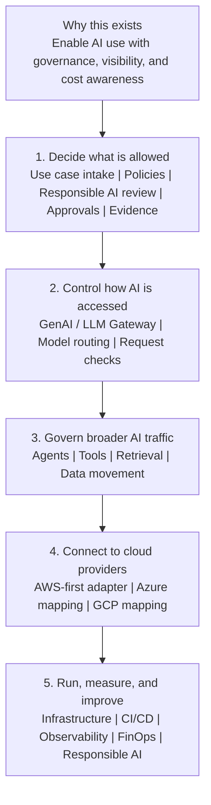
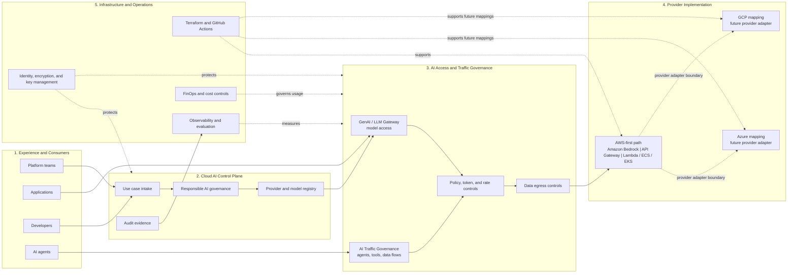
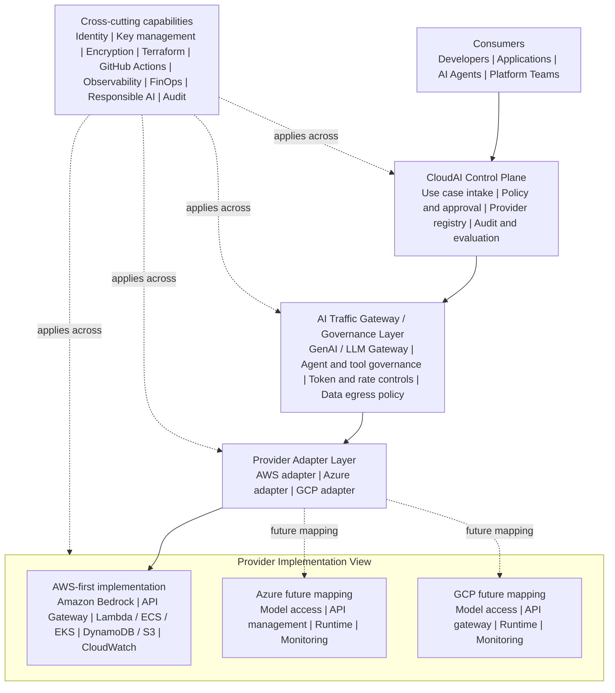
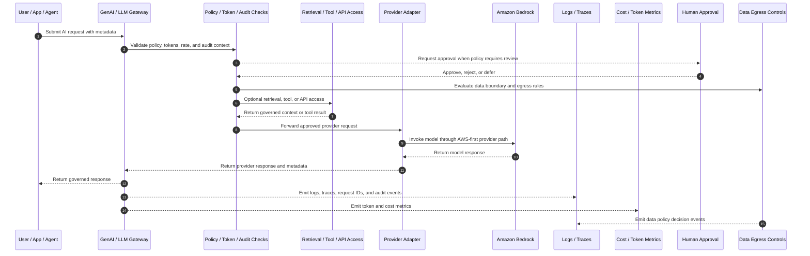

# Architecture

`cloudai-platform` presents a Cloud AI Control Plane for governing model access, AI traffic, provider integration, platform foundations, observability, and cost controls across cloud environments.

The platform is AWS-first, with Amazon Bedrock as the initial model provider pattern. Its control-plane design remains provider-neutral so Azure and GCP mappings can be added without changing the core governance model.

## Logical Layer Overview

Start here. This view explains the platform in plain language before the later diagrams add system and implementation detail.

- CloudAI Control Plane: use case intake, policy, approval, responsible AI review, provider registry, audit, and evaluation.
- Model access sub-layer: GenAI / LLM Gateway for governed model routing, request controls, and response handling.
- AI Traffic Governance layer: broader future gateway controls for agent, tool, retrieval, workflow, and data-access traffic.
- Provider Adapter layer: AWS first, with Azure and GCP reference architecture mappings.
- Platform Foundations: identity, encryption, key management, network, CI/CD, observability, and infrastructure automation.

This logical view introduces the role of each layer before the system and technical diagrams describe provider adapters, gateways, and runtime flows.

The GenAI / LLM Gateway is the first concrete runtime access pattern. The CloudAI Control Plane is not just a runtime hop; it is the governance and evidence layer that defines which use cases, providers, controls, and audit expectations apply. The broader AI Traffic Governance layer is intentionally described before implementation so future agent and tool flows can inherit the same policy, audit, observability, FinOps, and responsible AI model.

## Cloud & AI Platform System View

This system view shows the overall Cloud & AI platform story: consumer entry points, control-plane governance, runtime access and traffic controls, provider implementation paths, and operating capabilities. It is intentionally higher level than the technical architecture view below.

## High-Level CloudAI Platform Architecture

This diagram shows the control and integration layers rather than a deployed topology. The CloudAI Control Plane defines controls and evidence. The AI Traffic Gateway / Governance Layer applies those controls to model access now and broader AI traffic later. AWS is the first implementation path; Azure and GCP are shown as future provider mappings behind the same adapter boundary.

## Runtime Request Flow

Runtime requests do not bypass governance. Even in future agent or tool flows, the expected pattern is to capture request metadata, evaluate policy, control tokens and data egress, emit observability and FinOps signals, and route through provider adapters.

## Relationship to the Six-Layer Enterprise AI Model

The six-layer enterprise AI model describes the broader capability map. This repository architecture describes how those capabilities are organised into a buildable reference implementation.

These two views are complementary, not conflicting. The six-layer model explains what platform capabilities are needed. The implementation model explains how this project structures those capabilities technically.

| Six-layer model | Repository implementation view | Explanation |
|---|---|---|
| Strategy | Project charter, roadmap, use case framing | Defines why the platform exists and what outcomes it supports. |
| Governance | CloudAI Control Plane, policy, approval, audit | Defines rules, controls, approval and evidence. |
| Data | RAG, retrieval, data access, data egress governance | Defines how knowledge and data are safely used. |
| Platform | GenAI / LLM Gateway, AI Traffic Governance, provider adapters | Provides standard access to models, tools, agents and provider services. |
| Infrastructure | AWS/Azure/GCP foundations, Terraform, IAM, network, KMS, key management | Provides secure runtime and deployment foundations. |
| Operations | Observability, FinOps, runbooks, assessment, gap tracking | Makes the platform measurable, supportable and continuously improvable. |

## First Iteration Boundary

This iteration creates documentation and placeholders only. It does not deploy infrastructure, set up provider access, or call real model APIs.
