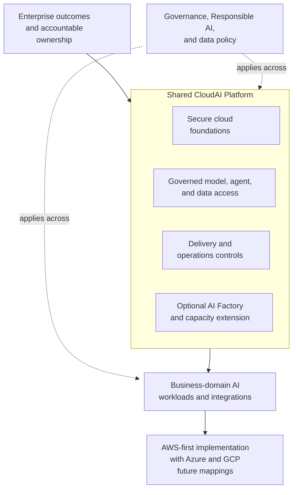
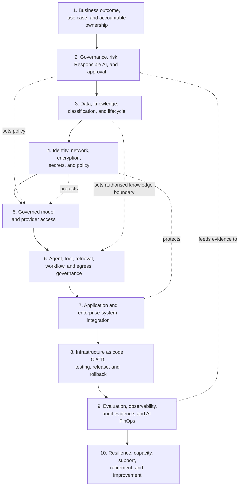
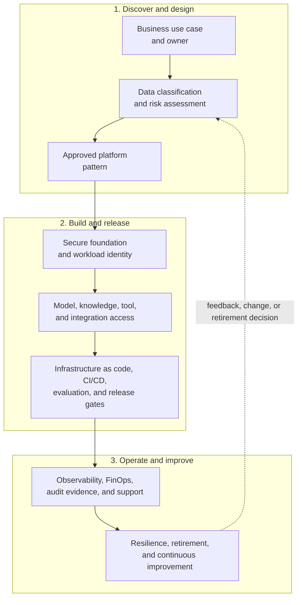

# CloudAI Architecture

`cloudai-platform` is a public-safe Cloud & AI Platform Engineering reference
architecture. It describes the reusable controls that help an enterprise move
AI workloads from a defined business outcome to supported operation. It is not
a deployed enterprise topology or a claim that every capability below is
implemented in this repository.

The architecture is AWS-first and multi-cloud-ready: AWS is the first provider
implementation path, while Azure and GCP remain reference mappings behind the
same governance and adapter boundaries.

## 1. Enterprise Ecosystem Context

The first view is intentionally broader than a gateway or a cloud service. It
shows the relationship between enterprise accountability, shared platform
capability, workload domains, and provider implementation.

This is a reference architecture, not a linear delivery pipeline. Governance
and data policy apply across both the shared platform and the workloads that
use it. The optional AI Factory and capacity extension is relevant where a use
case needs accelerated compute, training, fine-tuning, or high-scale serving;
it is not a prerequisite for managed-model workloads.

## 2. Enterprise AI Capability Map

The six-layer enterprise AI model explains **what capabilities** a mature
enterprise needs. It is an executive and solution-architecture map, not a
deployment diagram.

| Enterprise capability layer | Core question |
| --- | --- |
| Strategy and operating model | Why is AI used, and who is accountable for value and outcomes? |
| Governance | What is allowed, what risk applies, and what evidence is required? |
| Data and knowledge | Which information may be used, retained, retrieved, or shared? |
| AI platform | How do workloads access shared models, agents, tools, and knowledge safely? |
| Cloud foundations | Under what identity, network, encryption, policy, and runtime boundary does it operate? |
| Delivery and operations | How is it released, evaluated, observed, cost-managed, supported, and retired? |

## 3. CloudAI Platform Reference Architecture

The CloudAI architecture turns the six capability layers into ten practical
platform domains. The domains are a reference model for organising controls;
they do not imply that all domains are centralised in one product or owned by
one team.

| Six-layer capability map | CloudAI reference domains |
| --- | --- |
| Strategy and operating model | 1. Business outcome, use case, and accountable ownership |
| Governance | 2. Governance, risk, Responsible AI, and approval |
| Data and knowledge | 3. Data, knowledge, classification, and lifecycle |
| AI platform | 5. Governed model and provider access; 6. Agent, tool, retrieval, workflow, and egress governance; 7. Application and enterprise-system integration |
| Cloud foundations | 4. Identity, network, encryption, secrets, and policy |
| Delivery and operations | 8. Delivery engineering; 9. Evaluation, observability, audit evidence, and AI FinOps; 10. Resilience, capacity, support, retirement, and improvement |

The six layers and the ten domains are complementary. The former describes the
enterprise capability model; the latter describes the CloudAI platform
reference architecture.

## 4. Use Case to Production Lifecycle

The lifecycle explains **how one workload moves through the architecture**. It
is not another layer stack, and individual controls may iterate as the use case
changes.

The lifecycle starts by establishing a business outcome, accountable owner,
data classification, and risk posture. An approved pattern then moves through
secure foundations, governed access, and release controls before it enters
operation. Operational evidence, cost, support, resilience, and retirement
decisions feed back into assessment whenever the workload, its data, or its
risk profile changes. This is a delivery and operating cycle—not a seventh
enterprise capability layer or a claim that every step is automated.

## 5. Implementation and Provider Views

The following views connect the reference architecture to the portfolio. Each
is intentionally bounded and should be read with its stated evidence boundary.

| Architecture area | Portfolio evidence and boundary |
| --- | --- |
| Governed model access | [GenAI / LLM Gateway](genai-llm-gateway.md) and the [Governed AI Gateway case study](featured-solutions.md#governed-ai-gateway): implemented with mock mode as the default; provider mode is an explicit, bounded action. |
| Data and knowledge controls | [RAG knowledge lifecycle](rag-knowledge-lifecycle.md) and the [Governed RAG Lifecycle case study](featured-solutions.md#governed-rag-lifecycle): implemented as a local synthetic workflow, not provider-backed retrieval. |
| Delivery engineering | [AI release engineering on EKS](ai-release-engineering-on-eks.md) and the [EKS case study](featured-solutions.md#ai-release-engineering-on-eks): sandbox-validated delivery controls for a synthetic workload. |
| Bounded provider access | [P8 Bedrock sandbox design](p8-real-bedrock-sandbox-design.md) and the [Bounded Bedrock Sandbox case study](featured-solutions.md#bounded-bedrock-sandbox): bounded synthetic sandbox validation, not a persistent Bedrock application. |
| Agent runtime extension | [P8h AgentCore knowledge-lookup readiness](p8h-agentcore-knowledge-lookup-readiness.md): gateway-first reference design only; no AgentCore resource or call. |
| AI Factory and accelerated capacity | [AI Factory infrastructure lens](ai-factory-infrastructure-lens.md) and [AI Workload Operating Contract](ai-workload-operating-contract.md): future/design context for LLMOps, workload readiness, capacity, and accelerator patterns; no GPU, training, fine-tuning, or high-scale serving implementation. |
| Multi-cloud mappings | [AWS](aws-reference-architecture.md), [Azure](azure-reference-architecture.md), and [GCP](gcp-reference-architecture.md) mappings: AWS-first implementation context with Azure/GCP reference mappings, not provider parity claims. |

## 6. Current Implementation and Evidence Status

The architecture above includes the full ecosystem. The following table states
what this repository currently demonstrates publicly.

| Area | Implementation and evidence status |
| --- | --- |
| Governed AI Gateway | Implemented — mock-first |
| AI Release Engineering on EKS | Implemented — sandbox-validated for a synthetic workload |
| Governed RAG Lifecycle | Implemented — local synthetic workflow |
| Bounded Bedrock Sandbox | Implemented — bounded synthetic sandbox validation |
| AgentCore | Reference architecture only; no AgentCore resource or call |
| Azure and GCP | Reference mappings only |
| AI Factory and accelerated capacity | Future/design context only; no GPU, training, fine-tuning, or high-scale serving implementation |

For the detailed evidence record and intentionally deferred scope, read
[Current status](current-status.md). The repository contains no employer,
customer, confidential, credential, or proprietary material. It uses synthetic
data, generic identifiers, public cloud service patterns, and mock mode as the
ordinary runtime path.
