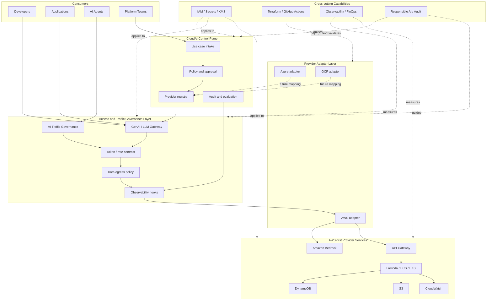
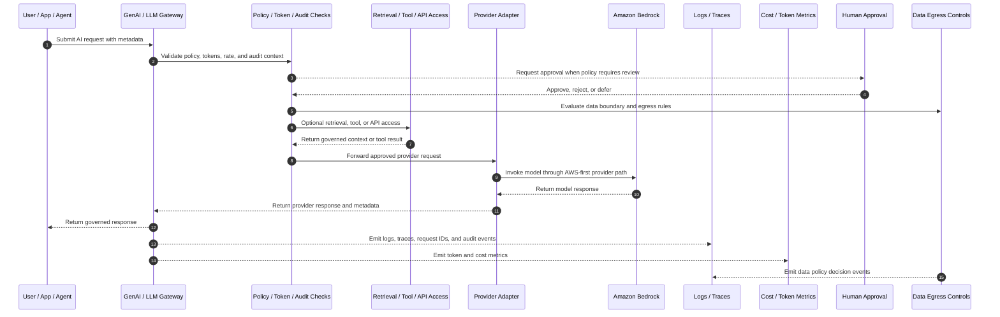

# Architecture

`cloudai-platform` models an Enterprise AI Control Plane that separates governance, model access, AI traffic controls, provider integration, platform foundations, observability, and cost controls.

The first implementation path is AWS-first. Amazon Bedrock is represented as the primary model provider pattern, while the control-plane concepts remain provider-neutral so Azure and GCP mappings can be added later.

## Logical Layers

- CloudAI Control Plane: use case intake, policy, approval, provider registry, audit, and evaluation.
- Model access sub-layer: GenAI / LLM Gateway for governed model routing, request controls, and response handling.
- AI Traffic Governance layer: broader future gateway controls for agent, tool, retrieval, workflow, and data-access traffic.
- Provider Adapter layer: AWS first, with Azure and GCP mapping notes.
- Platform Foundations: identity, secrets, encryption, network, CI/CD, observability, and infrastructure automation.

The GenAI / LLM Gateway is the first concrete runtime access pattern. The CloudAI Control Plane is not just a runtime hop; it is the governance and evidence layer that defines which use cases, providers, controls, and audit expectations apply. The broader AI Traffic Governance layer is intentionally described before implementation so future agent and tool flows can inherit the same policy, audit, observability, FinOps, and responsible AI model.

## High-Level CloudAI Platform Architecture

This view separates governance from runtime request handling. The CloudAI Control Plane defines controls and evidence. The Access and Traffic Governance layer applies those controls to model requests now and broader AI traffic later. Provider adapters keep AWS implementation concrete while preserving space for Azure and GCP mappings.

## Runtime Request Flow

Runtime requests do not bypass governance. Even in future agent or tool flows, the expected pattern is to capture request metadata, evaluate policy, control tokens and data egress, emit observability and FinOps signals, and route through provider adapters.

## Relationship to the Six-Layer Enterprise AI Model

The six-layer enterprise AI model describes the broader operating model and capability map. This repository architecture describes how those capabilities are organised into a buildable reference implementation.

These two views are complementary, not conflicting. The six-layer model explains what enterprise capabilities are needed. The implementation model explains how this project structures those capabilities technically.

| Six-layer model | Repository implementation view | Explanation |
|---|---|---|
| Strategy | Project charter, roadmap, use case framing | Defines why the platform exists and what outcomes it supports. |
| Governance | CloudAI Control Plane, policy, approval, audit | Defines rules, controls, approval and evidence. |
| Data | RAG, retrieval, data access, data egress governance | Defines how enterprise knowledge and data are safely used. |
| Platform | GenAI / LLM Gateway, AI Traffic Governance, provider adapters | Provides standard access to models, tools, agents and provider services. |
| Infrastructure | AWS/Azure/GCP foundations, Terraform, IAM, network, KMS, secrets | Provides secure runtime and deployment foundations. |
| Operations | Observability, FinOps, runbooks, assessment, gap tracking | Makes the platform measurable, supportable and continuously improvable. |

## First Iteration Boundary

This iteration creates documentation and placeholders only. It does not deploy infrastructure, create credentials, or call real model APIs.
