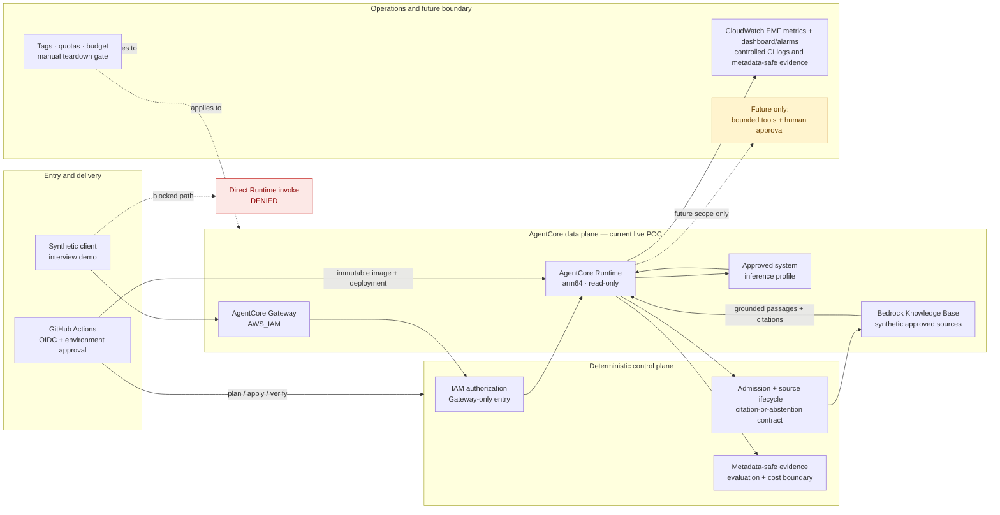

# AgentCore Governed RAG POC

## Purpose

This personal sandbox demonstrates how a regulated enterprise can
provide safe, read-only knowledge assistance without allowing an AI model to
decide access, safety, or execution outcomes.

It is a learning and portfolio proof of concept. It will use only synthetic,
self-authored documentation in Sydney (`ap-southeast-2`), and it is not a
production deployment claim.

## Status

The synthetic data foundation, arm64 Runtime, IAM Gateway, Runtime target,
Knowledge Base ingestion, direct Bedrock preflight, and synthetic Gateway
invocation are complete through protected GitHub Actions/Terraform. The
current sandbox remains deployed for demonstration; teardown is a separate,
explicitly approved operation. No production or employer data is involved.

Final RAG evidence: [Gateway validation run 32144157616](https://github.com/afaryy/cloudai-platform/actions/runs/32144157616). Observability evidence is recorded in the [P8i key process record](../solutions/p8i-agentcore-rag-key-process-record.md), including the successful policy update, alarm state recovery, and zero-change reconciliation runs.

## Architecture Principle

> **Deterministic controls govern risk; AI provides bounded,
> evidence-based assistance.**

IAM, gateway policy, knowledge-source lifecycle, approval rules, and disable
controls decide whether work is allowed. The model can only provide a grounded
answer with citations, or an explicit inability-to-answer result when evidence
is insufficient.



**How to read the diagram:** the Gateway is the only external runtime entry;
the Runtime may orchestrate read-only retrieval but does not decide access or
execute tools; deterministic controls decide admission, source lifecycle, and
whether the response must abstain; observability and cost evidence stay
metadata-safe. The dashed tool/approval path is future scope, not a deployment
claim.

## Architecture Walkthrough

### 1. Request path

1. A synthetic client sends a knowledge question to the AgentCore Gateway.
   The Gateway is protected by AWS IAM, so the caller must present an approved
   workload identity. There is no anonymous public entry point.
2. The Gateway resolves the single approved Runtime target. Direct invocation
   of the Runtime is intentionally rejected; this keeps the external contract
   and the authorization boundary in one place.
3. The Runtime performs deterministic admission checks before calling Bedrock.
   It verifies the request shape, enabled-workload state, approved source
   lifecycle, and read-only response contract. The model is not allowed to
   decide whether the caller or source is authorised.
4. The Runtime asks the Bedrock Knowledge Base to retrieve grounded passages
   using the approved system inference profile. The current corpus is
   synthetic and self-authored; no customer, employer, internal, or production
   data is part of the path.
5. The Runtime validates the retrieval result. A supported citation produces a
   sanitised answer with a citation-present flag. Missing evidence, a retired
   source, or a provider failure produces a bounded abstention reason instead
   of an invented answer or provider diagnostic.
6. The Gateway returns the sanitised response to the caller. The caller sees
   the stable response contract, not credentials, raw prompts, provider ARNs,
   endpoints, or internal exception details.

### 2. Control-plane versus data-plane responsibilities

| Plane | Responsibility | Current implementation boundary |
| --- | --- | --- |
| Entry control | Authenticate the caller and select the approved target | AgentCore Gateway with IAM; Gateway-only external entry |
| Admission control | Decide whether the request, workload, and source are allowed | Deterministic Runtime checks and source-lifecycle contract |
| Retrieval control | Access the approved corpus and generation boundary | Bedrock Knowledge Base plus the approved system inference profile |
| Response control | Enforce citation-or-abstention and sanitisation | Runtime response validator and bounded reason codes |
| Delivery control | Build, publish, deploy, and verify immutable artifacts | GitHub Actions, OIDC, Terraform, protected environments, and exact confirmation phrases |
| Evidence control | Retain enough evidence to reproduce a decision without retaining sensitive content | Metadata-safe CI artifacts, logs, evaluation outcomes, timestamps, and cost boundary |
| Future action control | Govern tools, writes, human approval, and autonomous actions | Not deployed; represented only as a separately gated AgentCore-native extension |

This separation is the main architecture lesson. The Gateway and Runtime are
not just an API wrapper around a model. They form a governed platform boundary
where identity, policy, source lifecycle, evaluation, operations, and cost are
explicit responsibilities.

### 3. Failure and denial semantics

The safe path is intentionally narrower than a general chatbot path:

```text
valid identity + active source + grounded citation
        -> answer

missing citation / insufficient evidence
        -> abstain: insufficient_evidence

retired or disabled source/workload
        -> deny before retrieval

provider timeout or unavailable retrieval
        -> abstain: retrieval_unavailable

direct Runtime request
        -> deny: gateway_only_entry
```

These outcomes are deterministic and testable. A later tool-enabled design
must add equivalent boundaries for `tool_not_allowed` and
`human_approval_required`; it must not turn a confidence score into an
authorization decision.

### 4. Delivery and operational path

The delivery path is separate from the user request path. GitHub Actions uses
short-lived AWS credentials through OIDC, applies Terraform only after a
protected-environment approval, and publishes an immutable Runtime image before
deploying the Gateway and target. The CI workflow then runs a direct Bedrock
preflight and an IAM-authenticated Gateway invocation to prove the response
contract.

Operational evidence is deliberately metadata-safe. It records the outcome,
reason code, citation-present flag, source lifecycle decision, timestamp,
latency/cost bucket, and evaluation result. It does not retain raw prompts,
raw answers, credentials, or unrestricted provider diagnostics. Budget tags,
quotas, and a manual teardown gate remain part of the sandbox operating model;
the sandbox is currently kept deployed for demonstrations.

### Framework-neutral evaluation telemetry

The evaluation boundary separates an agent framework from the quality gate.
Synthetic OpenTelemetry GenAI and OpenInference traces are normalized into one
contract before deterministic scenario and trajectory checks are applied. The
direct evaluation path is beside, not inside, the deployed Runtime and
CloudWatch path:

```text
local fixtures -> direct sessionSpans -> AgentCore Evaluate -> provider-direct evidence

Gateway -> Runtime -> ADOT -> CloudWatch -> AgentCore Evaluate -> provider-runtime evidence
                                Stage B: not implemented by this change
```

Accepted scopes are limited to `opentelemetry.instrumentation.*` and
`openinference.instrumentation.*`. The gate checks invoke-agent, inference,
and execute-tool evidence, including `local.telemetry_compatibility` and
`local.tool_trajectory_accuracy`. `local-contract` evidence is locally
contract-tested and its ordinary CI job does not call AWS. Stage A source
implements the `provider-parity-v1` fixed, six-call direct-spans request matrix
for future `provider-direct` evidence; provider validation is pending. It
precedes Runtime ingestion so the reviewed spans, scenario, evaluator matrix,
and metadata boundary can be checked without claiming that the Runtime emits
or CloudWatch receives them. Stage B Runtime-to-CloudWatch evidence is the
future `provider-runtime` lane and is not implemented.

Managed scores supplement deterministic controls; they never authorize IAM,
tool execution, deployment, remediation, rollback, or deletion. No provider,
runtime, or production evaluation has been validated. The operating procedure
and non-claim boundary are in the
[agent evaluation telemetry runbook](../solutions/agent-evaluation-telemetry-runbook.md).

### 5. What this diagram does and does not claim

The diagram claims a live, synthetic AWS Gateway + Runtime + Bedrock RAG path
with protected CI/CD and fail-closed response behaviour. It does not claim a
production enterprise topology, multi-region resilience, GPU serving, model
training, tool execution, autonomous writes, or a completed Azure/GCP
deployment. Those are separate design or validation tracks with their own
identity, budget, evaluation, and teardown gates.

## Scope and Boundaries

The initial user story is a Cloud & AI Platform question answered only from an
approved synthetic knowledge source. The response must contain supporting
citations or safely abstain.

The POC excludes customer, employer, internal, confidential, and production
data. It also excludes tools, writes, browser access, code execution, durable
memory, autonomous actions, and automated teardown.

## Delivery Control Plane

Terraform is the sole infrastructure definition. GitHub Actions is the sole
deployment path and obtains short-lived AWS credentials through GitHub OIDC.
There is no local AgentCore CLI deployment path.

```text
GitHub Environment approval
        ↓
Terraform bootstrap (ECR + dedicated image-publisher role)
        ↓
GitHub Actions builds and pushes an immutable image digest
        ↓
Terraform deploy (Runtime + IAM Gateway + single target)
        ↓
Gateway-only synthetic validation and sanitized evidence
```

The workflow separates bootstrap, image publication and runtime deployment.
Each apply requires a GitHub Environment approval and an exact confirmation
phrase. The Gateway uses `AWS_IAM`; it is not an anonymous public endpoint.

## Required Evidence

Before and after any sandbox deployment, the portfolio will retain only
sanitized evidence for:

- Gateway-only access and rejection of direct Runtime invocation.
- Active versus retired knowledge-source behaviour.
- Cited answer, safe abstention, and deterministic admission-blocked scenarios.
- Behavioural cases for missing citations, stale sources, provider timeout,
  denied tools, and human-approval boundaries, with explicit evidence levels.
- Named ownership, least-privilege boundary, budget tags, and cost range.
- Metadata-only observability, emergency-disable outcome, and complete
  teardown.

## Delivery Stages

1. Provider-neutral Governed RAG Contract: one synthetic corpus, a shared
   evaluation set, and fixed control/evidence criteria across AWS, Azure, and
   GCP.
2. Local AWS contracts and synthetic evaluation cases.
3. Reviewed AWS preflight: identity, region, model access, quotas, IAM,
   budget, logs, and teardown plan.
4. Completed explicitly approved small AWS sandbox deployment through GitHub Actions.
5. Completed sanitized direct-preflight and Gateway validation evidence.
6. Optional teardown through a separately reviewed plan and confirmation.
7. Azure and GCP equivalent architecture mappings, followed by optional
   small validations only when their own preflight, budget, and teardown
   gates have been reviewed.

Any failed preflight condition stops the work before cloud resources are
created.

## Three-Cloud Comparison Boundary

This POC is the AWS flagship implementation of a wider **Governed RAG
Reference**. It compares control and operating patterns, not a vendor ranking
or an uncontrolled model-quality contest.

Every provider mapping must use the same synthetic source material and test:

- authenticated access and named ownership;
- approved source lifecycle and retrieval boundary;
- grounded citations or an explicit abstention;
- deterministic policy decisions outside the model;
- evaluation and metadata-safe observability;
- cost ownership, safe failure, and teardown.

| Provider | Initial reference path | Evidence level |
| --- | --- | --- |
| AWS | AgentCore Gateway + Runtime + Bedrock Knowledge Bases + deterministic citation/abstention contract | Live POC after explicit approval |
| Azure | Foundry and Azure AI Search RAG mapping | Architecture mapping first; optional validation later |
| GCP | Vertex AI RAG Engine mapping | Architecture mapping first; optional validation later |

The public comparison will distinguish verified behaviour, architecture-level
equivalence, and future validation. It will never imply a deployed workload
where only a documented mapping exists.

## Relationship to Existing Work

- [AgentCore Knowledge-Lookup Readiness](../solutions/p8h-agentcore-knowledge-lookup-readiness.md)
  defines the initial gateway-first control boundaries.
- [AgentCore Synthetic Knowledge-Lookup Contract Pack](../solutions/p8i-agentcore-synthetic-contract-pack.md)
  provides local fail-closed admission and closure evidence.
- [Governed RAG Lifecycle](../solutions/rag-knowledge-lifecycle.md) provides
  related source-lifecycle patterns.

## Interview Positioning

> Designed and validated a governed Amazon Bedrock AgentCore POC with
> Gateway-enforced access, least-privilege Runtime orchestration, a
> deterministic citation/abstention contract, synthetic RAG citations, Terraform-defined infrastructure,
> GitHub Actions OIDC delivery, metadata-only observability, cost controls,
> and a tested teardown path.
