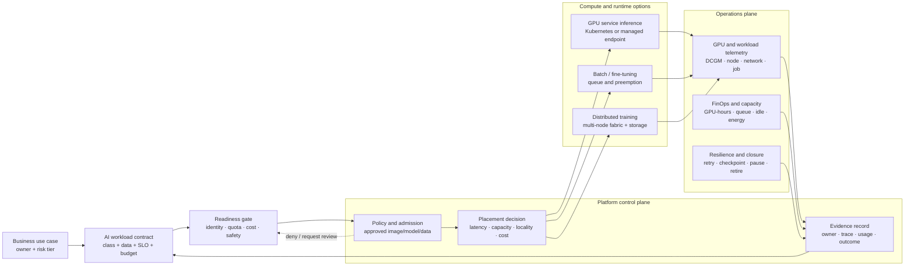

# AI Factory, GPU, and AI Data-Centre Workload Readiness

## Status and boundary

**Design and research track — no GPU or AI data-centre deployment.**

This document defines the readiness model for future accelerated workloads in
the CloudAI Platform portfolio. It does not create a GPU node, Kubernetes GPU
operator, SageMaker HyperPod cluster, Slurm scheduler, model-training job, or
data-centre resource. Any future sandbox requires a separate reviewed design,
budget, quota, access, observability, rollback, and teardown plan.

The goal is to answer an architecture question before selecting hardware:

> Can this workload be admitted, placed, operated, measured, paused, and
> retired safely on scarce accelerated capacity?

## Core architecture view

GPU readiness is a workload and operating-model problem, not only a cluster
provisioning problem. The platform must connect business intent, data boundary,
accelerator placement, scheduling, observability, FinOps, resilience, and
retirement evidence.

## Workload profiles

The profile determines the scheduling, observability, cost, and resilience
requirements. A single GPU platform should not treat all workloads as one
homogeneous queue.

| Profile | Primary objective | Capacity shape | Required controls |
| --- | --- | --- | --- |
| Interactive inference | Meet user-facing latency and availability targets | Reserved or autoscaled accelerators; predictable concurrency | latency SLO, model/version rollout, token and request budget, fallback path |
| Agent/RAG inference | Complete a bounded task with retrieval/tool context | Mixed CPU/GPU capacity; bursty multi-call sessions | workload identity, tool boundary, trace correlation, behavioural evaluation, human escalation |
| Batch inference | Complete a large job economically | Queue-based, retryable, interruptible capacity | priority, retry limit, completion criterion, output retention, cost ceiling |
| Fine-tuning | Produce an evaluated model or adapter | Accelerator reservation with checkpoint storage | dataset lineage, checkpoint policy, evaluation gate, quota and spend stop |
| Distributed training | Scale a training job across nodes | Topology-aware GPUs, high-throughput storage and fabric | gang scheduling, checkpoint/restart, node-health evidence, failure recovery |
| Embeddings/RAG indexing | Refresh searchable knowledge safely | CPU/GPU mix with storage and ingestion bandwidth | source lifecycle, idempotency, freshness SLO, provenance and rollback |

## Decision boundaries

### Kubernetes and GPU service workloads

Kubernetes can expose GPUs through device plugins and schedule workloads using
extended resources. The Kubernetes guidance treats GPU resources as schedulable
capacity, while the platform still owns namespace, identity, quotas, network,
image provenance, and lifecycle controls. See the [Kubernetes GPU scheduling documentation](https://kubernetes.io/docs/tasks/manage-gpus/scheduling-gpus/).

For a future EKS path, the decision sequence should be:

1. Prove the workload contract locally with synthetic input.
2. Select a supported accelerator and runtime image.
3. Confirm driver, container toolkit, device-plugin, and framework compatibility.
4. Define node groups, taints/tolerations, quotas, topology, and scale limits.
5. Add GPU telemetry and cost attribution before admitting the workload.
6. Validate rollout, rollback, pause, and teardown through GitHub Actions.

### Kueue-aware admission contract

Kubernetes device plugins are the baseline for exposing and scheduling an
allocated GPU as an extended resource. They do not, by themselves, define a
shared-capacity operating model: which team may wait for capacity, who may
borrow it, which prerequisites must pass, or when a job should be preempted.

The workload-readiness schema therefore introduces a **Kueue-aware admission
contract**. It is metadata-only and does not create live Kueue resources. The
contract records the intent that a future Kueue `LocalQueue` and `ClusterQueue`
would enforce:

| Contract field | Future scheduler decision |
| --- | --- |
| `resourceFlavor` | Select the approved accelerator, locality, availability, or price class. |
| `localQueue` and `clusterQueue` | Connect a workload owner to a governed shared-capacity boundary. |
| `cohort` and `borrowingLimit` | Make any capacity sharing explicit rather than implicit. |
| `admissionChecks` | Require budget, image, data-boundary, topology, or human approval before admission. |
| `topologyIntent` and `gangScheduling` | Express locality or all-or-nothing placement intent for multi-node work. |
| `maxQueueWaitSeconds`, retry, and preemption policy | Bound waiting and recovery behaviour before a workload consumes capacity. |

The next fixture task will adopt these fields for each synthetic workload
profile and decide where they become mandatory. This task deliberately leaves
existing fixtures valid while the design contract is introduced.

[Dynamic Resource Allocation](https://kubernetes.io/docs/concepts/scheduling-eviction/dynamic-resource-allocation/)
is a future advanced allocation path for devices and topology-aware resources;
it does not replace the device-plugin baseline in this portfolio today. A real
Kueue or DRA deployment requires the separately reviewed GPU POC plan,
Terraform/GitHub Actions delivery path, budget cap, telemetry and teardown
controls.

### SageMaker HyperPod and managed capacity

SageMaker HyperPod is a reference option for larger training, fine-tuning, and
high-throughput inference workloads. Its EKS-orchestrated path includes task
governance, shared capacity, observability, and usage reporting concepts. It is
not a requirement for this project and should not be deployed until a real
workload profile justifies its operational and cost complexity.

The official HyperPod usage-reporting model is useful for this portfolio because
it distinguishes allocated and borrowed compute and can attribute GPU/CPU or
Neuron Core usage to teams and tasks. See [HyperPod usage reporting](https://docs.aws.amazon.com/sagemaker/latest/dg/sagemaker-hyperpod-usage-reporting.html).

### Distributed training and data-centre design

Distributed training adds constraints that are not present in ordinary API
serving:

- gang scheduling and all-or-nothing placement;
- GPU topology, NVLink/NVSwitch, EFA or equivalent fabric;
- checkpoint throughput and restart time;
- shared filesystem/object-storage bandwidth;
- power, cooling, rack, region, and capacity availability;
- provider concentration and reservation risk.

These are design inputs, not reasons to deploy a cluster immediately. A future
AI data-centre readiness review should treat power, cooling, fibre, storage,
accelerator supply, and compliance as external dependencies of the compute
platform.

## Observability model

GPU telemetry must connect hardware health to workload outcomes. A dashboard
showing high utilisation alone does not prove that a job is productive or
meeting its SLO.

### Minimum signal groups

| Signal group | Examples | Decision supported |
| --- | --- | --- |
| Hardware health | temperature, power, memory, XID/error, PCIe/NVLink health | isolate or replace unhealthy capacity |
| GPU utilisation | SM utilisation, memory utilisation, allocation, idle time | right-size and detect stranded capacity |
| Workload performance | queue time, time-to-first-token, tokens/sec, task goodput, error rate | validate SLO and placement |
| Scheduler | pending age, priority, preemption, retries, backoff, quota | tune admission and fairness |
| Storage/network | throughput, latency, EFA/fabric health, checkpoint duration | identify data or fabric bottlenecks |
| Cost/energy | GPU-hours, CPU-hours, borrowed capacity, token cost, energy estimate | stop, charge back, or change placement |

NVIDIA DCGM Exporter is a reference telemetry component for future Kubernetes
GPU nodes. It exposes selected DCGM fields as Prometheus metrics and can map
metrics to Kubernetes pods when configured appropriately. See [NVIDIA DCGM Exporter installation](https://docs.nvidia.com/datacenter/dcgm/latest/installation/install-dcgm-exporter.html) and the [DCGM metric reference](https://docs.nvidia.com/datacenter/dcgm/latest/reference/dcgm-exporter-metrics.html).

For HyperPod, the official observability add-on combines DCGM, node, EFA,
filesystem, Kubernetes, Kueue, and task metrics into Amazon Managed Service
for Prometheus and Amazon Managed Grafana dashboards. CloudWatch remains a
complementary option for infrastructure metrics and alarms. See [HyperPod cluster and task observability](https://docs.aws.amazon.com/sagemaker/latest/dg/sagemaker-hyperpod-eks-cluster-observability-cluster.html).

The project does not currently deploy these GPU tools. The current AgentCore
POC has bounded CloudWatch EMF metrics, dashboards, and alarms; that evidence
is a foundation for the metadata and ownership model, not GPU telemetry proof.

## FinOps and capacity controls

The cost unit should be connected to a useful outcome, not only to instance
runtime:

- GPU-hours and CPU-hours by owner, namespace, workload, and environment;
- allocated versus borrowed capacity;
- queue wait and preemption time;
- idle or underutilised accelerator time;
- tokens or completed tasks per GPU-hour;
- checkpoint and storage cost;
- model quality or task goodput per dollar;
- energy or power estimate where the operator can provide it.

Every future workload must declare:

1. budget owner and cost centre;
2. maximum spend or runtime;
3. quota and reservation boundary;
4. stop condition for idle, failed, or low-value execution;
5. retention period for checkpoints, logs, and outputs;
6. rollback or pause procedure.

## Resilience and safety boundaries

The readiness gate must verify more than capacity:

| Gate | Fail-closed condition |
| --- | --- |
| Identity | No named workload identity, owner, or shutdown owner |
| Data | Unclassified data, unapproved egress, or missing provenance |
| Supply chain | Unapproved image, driver, framework, model, or dependency |
| Capacity | No quota, reservation, supported driver/runtime, or placement decision |
| Cost | No budget, cost centre, stop condition, or usage attribution |
| Operations | No telemetry, alert owner, SLO, or incident path |
| Recovery | No checkpoint, retry, rollback, pause, or teardown plan |
| Governance | No human approval for high-risk data, training, or customer impact |

Preemption is a design choice, not an outage. Batch and training workloads
should be checkpointable and restartable. Interactive inference should have a
capacity fallback or explicit degraded-mode response. Autonomous agent actions
must remain behind the existing identity, tool, policy, and human-approval
boundaries.

## Current evidence and future work

| Capability | Current project evidence | Next safe increment |
| --- | --- | --- |
| Workload contract | Documentation-first service, batch, fine-tuning, and distributed-training profiles; synthetic Agent/RAG, batch, fine-tuning, and distributed-training fixtures with contract tests | Add an embeddings/RAG-indexing fixture when a new readiness decision requires it |
| Cloud foundations | Terraform, GitHub OIDC, IAM, EKS release patterns, bounded CloudWatch | Map GPU node/identity/quota controls without deploying nodes |
| Observability | AgentCore EMF/dashboard/alarm contract | Define GPU metric names and dashboard panels using synthetic fixtures |
| FinOps | AI FinOps principles and bounded cost metadata | Create a synthetic GPU-hour/queue/cost allocation example |
| Scheduling | Conceptual placement and queue boundaries | Compare Kubernetes scheduler, Kueue, and managed task governance |
| Accelerated runtime | No GPU deployment | Review one small, time-boxed sandbox only after budget and teardown approval |
| Data-centre readiness | AI Factory infrastructure lens and public research | Add power, cooling, storage, fabric, sovereignty, and capacity checklist |

## Explicit non-goals

- No GPU instance provisioning in this task.
- No NVIDIA driver, GPU Operator, DCGM Exporter, HyperPod, Slurm, or EFA
  deployment.
- No model training, fine-tuning, or high-scale inference.
- No persistent cluster or data-centre commitment.
- No claim of production GPU operations or enterprise capacity planning.

## Sources and research notes

- [Kubernetes: Schedule GPUs](https://kubernetes.io/docs/tasks/manage-gpus/scheduling-gpus/)
- [Kubernetes: Dynamic Resource Allocation](https://kubernetes.io/docs/concepts/scheduling-eviction/dynamic-resource-allocation/)
- [Kueue concepts](https://kueue.sigs.k8s.io/docs/concepts/)
- [Amazon SageMaker HyperPod](https://docs.aws.amazon.com/sagemaker/latest/dg/sagemaker-hyperpod.html)
- [HyperPod cluster and task observability](https://docs.aws.amazon.com/sagemaker/latest/dg/sagemaker-hyperpod-eks-cluster-observability-cluster.html)
- [HyperPod usage reporting for cost attribution](https://docs.aws.amazon.com/sagemaker/latest/dg/sagemaker-hyperpod-usage-reporting.html)
- [NVIDIA DCGM Exporter installation](https://docs.nvidia.com/datacenter/dcgm/latest/installation/install-dcgm-exporter.html)
- [NVIDIA DCGM Exporter metrics](https://docs.nvidia.com/datacenter/dcgm/latest/reference/dcgm-exporter-metrics.html)
