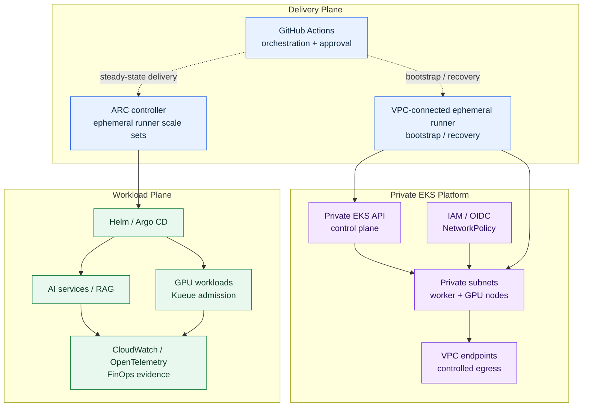
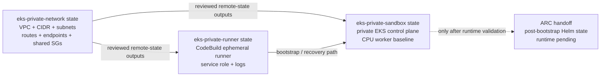

# Private EKS Reference Architecture for AI and GPU Workloads

## Status

**YY-48 design complete; YY-49/YY-50 private-EKS source, VPC-connected runner,
and protected CI paths implemented; private-worker runtime validation remains
pending.**

This document defines the target topology for AI and GPU
architecture. The existing EKS sandbox remains a low-cost development profile
and is intentionally not treated as production-ready. The private variant is a
reviewed source and delivery path, not evidence that a private cluster or GPU
runtime is currently deployed.

## Why the separation matters

The current personal sandbox uses a small no-NAT network with public subnets to
keep development costs bounded. That is acceptable for source validation but
does not represent the preferred topology for private worker capacity.

For AI workloads, worker nodes and GPU nodes should not receive
public IP addresses. They should run in private subnets with explicit access to
AWS services, controlled outbound dependencies, workload identity, and
auditable operational evidence.

## Public sandbox versus private target

| Concern | Current development sandbox | Private target |
| --- | --- | --- |
| Worker placement | Existing public subnets | Private worker and GPU subnets |
| EKS API | Restricted public access plus private access as configured | Private endpoint target |
| Egress | No-NAT low-cost path | VPC endpoints plus controlled NAT/egress |
| Image source | Approved digest-pinned image path | Prefer private ECR mirror and promotion evidence |
| CI network | GitHub-hosted workflow path where reachable | VPC-connected runner for private API operations |
| GPU | Source path only unless separately approved | Private GPU node group after worker validation |
| Claim | Development validation | Production-oriented reference architecture |

### Why the public sandbox came first

The earlier EKS exercise was intentionally a **public-subnet development
sandbox**. Its purpose was to validate Terraform, EKS, Helm, Argo CD, GitHub
Actions, workload rollout, rollback, and teardown with a small and affordable
footprint. It was not intended to represent a production AI or GPU
topology, and that sandbox has since been destroyed.

“Public EKS” can describe two different properties and they should not be
conflated:

- **Public subnets:** worker nodes are placed in subnets with a public routing
  path and may be assigned public IPs.
- **Public API endpoint:** the EKS Kubernetes API is reachable through a
  public endpoint, normally restricted by an allowlist of CIDRs.

The previous sandbox primarily used the first pattern for development
convenience. A public-subnet sandbox is not inherently wrong; it is an
appropriate learning and source-validation profile when its exposure,
credentials, data, budget, and teardown boundaries are explicit.

### Why the private target is needed

The private EKS variant is a separate **AI and GPU target
architecture**, not an attempt to pretend that the low-cost sandbox was
production-ready. It moves workers and GPU capacity into private subnets,
targets a private-only Kubernetes API, and uses VPC endpoints and controlled
egress for AWS services and approved dependencies.

The private target is valuable because it:

- reduces direct exposure of worker and GPU nodes;
- provides clearer boundaries for RAG data, vector stores, model endpoints,
  and internal APIs;
- aligns with common platform expectations around identity, privacy, auditability,
  and operational resilience;
- supports private image, artifact, logging, secrets, and model-service access;
- makes egress, cost, and third-party dependencies explicit;
- demonstrates how a development sandbox can evolve into a production-oriented
  reference architecture.

The trade-off is real: private EKS costs more and requires endpoint, DNS,
route, egress, recovery-runner, and observability design. It is therefore not
automatically the right profile for every local experiment. For this project,
the two profiles are deliberately retained:

```text
Public-subnet EKS
  = low-cost development and delivery validation

Private-subnet EKS
  = AI / GPU target architecture
```

### Interview-ready explanation

> We used a public-subnet EKS sandbox for low-cost development validation. For
> AI and GPU workloads, we designed a private-subnet EKS target
> with private API access, controlled egress, VPC endpoints, workload identity,
> and independent recovery delivery.

This wording is accurate: the public sandbox proves selected delivery
mechanics, while the private design records the additional controls required
for secure, scalable, and governed workloads.

## Target topology



Dashed arrows represent GitHub workflow orchestration and approval. Solid
arrows represent a runtime, network, or delivery dependency. The ARC node is
shown in the Delivery Plane for readability, but its controller and runner
scale-set pods are deployed inside the Private EKS Platform after Phase 0 has
passed.

## Terraform state ownership

The source implementation uses three independently recoverable states. The
ownership direction is one-way: `eks-private-network` owns the VPC, VPC CIDR,
private subnets, routes, endpoints, shared worker security group, and delivery
runner security group. Both `eks-private-runner` and `eks-private-sandbox` now
consume that network remote state directly. The protected runner lifecycle
workflow is source implemented; provisioning its dedicated OIDC role and
protected runtime validation remain pending.



This avoids split ownership of VPC, subnet, endpoint, NAT, and shared
security-group resources. The EKS apply preflight rejects any plan that tries
to recreate the network foundation.

## Two-phase delivery architecture

The private-EKS design deliberately separates infrastructure lifecycle from
steady-state Kubernetes delivery. This is not an argument against the
GitHub Actions Runner Controller (ARC). ARC is the preferred in-cluster
delivery mechanism after the cluster exists. The independent VPC-connected
runner is the bootstrap, preflight, stop, and recovery mechanism that must be
available before ARC can exist and when the target cluster is unhealthy.

### Phase 0: VPC-connected infrastructure delivery

The first delivery path is an ephemeral GitHub Actions-compatible runner in a
private subnet, such as an AWS CodeBuild-hosted runner or an equivalently
isolated in-VPC build job. It receives work through outbound connectivity to
GitHub and uses short-lived OIDC credentials to call AWS APIs and, once the
control plane exists, the private Kubernetes API.

This path is responsible for:

- private VPC, endpoint, route, and security-group preflight;
- Terraform backend initialisation and isolated state operations;
- private EKS bootstrap and same-run plan preflight;
- endpoint, subnet, and no-public-IP verification;
- protected stop operations and state recovery;
- recovery when the target cluster or its ARC installation is unavailable.

The runner is not a permanent administrator. It should be short-lived, have a
dedicated trust policy, use a dedicated security group, retain only sanitised
evidence, and terminate after the job. The bootstrap role and the steady-state
workload role must remain separate.

### Phase 1: ARC steady-state delivery

After the private EKS control plane, worker nodes, network endpoints, and
baseline observability have been independently validated, install ARC in a
dedicated namespace. ARC then provides ephemeral runner scale sets for normal
Kubernetes delivery, including Helm, Argo CD, Kueue, GPU smoke workloads, and
cluster-local integration tests.

ARC runners should use a separate namespace and trust boundary from ordinary
application workloads. Use a GitHub App or equivalent short-lived
registration mechanism, Kubernetes RBAC and workload identity, restricted
network egress, and non-privileged/rootless execution where the build permits
it. Do not give an ARC runner the broad AWS permissions required to create or
recover the VPC and EKS control plane.

### Why ARC-only is insufficient for private-EKS bootstrap

| Concern | ARC-only design | Two-phase design |
| --- | --- | --- |
| Cluster creation | Circular dependency: ARC needs an existing EKS cluster and nodes | External runner creates the cluster, then ARC is installed |
| Private API access | GitHub-hosted jobs cannot be assumed to reach a private EKS API | Runner is placed on a reviewed VPC route to the private API |
| Cluster recovery | If EKS or ARC is unhealthy, the runner disappears with the dependency | Independent runner remains available to repair or stop the target |
| IAM scope | ARC would need broad account-level bootstrap permissions | Bootstrap role and in-cluster delivery role are separated |
| Network changes | Runner depends on the endpoints and routes it is creating | Runner uses a pre-existing approved connectivity path |
| Audit boundary | Infrastructure and workload changes share one execution trust domain | Lifecycle evidence and workload evidence are separated |
| Cost model | ARC requires a running cluster and controller even for bootstrap | Ephemeral VPC runner incurs cost only for lifecycle jobs |

The circular dependency is the decisive issue:

```text
ARC controller/runner pod
  requires EKS control plane + worker capacity
      requires VPC, IAM, endpoints, routes, and Terraform apply
          cannot be created by a runner that does not yet exist
```

The same boundary applies to recovery. If the private cluster is deleted,
cannot schedule pods, or has an endpoint/network failure, an in-cluster ARC
runner cannot be the only mechanism used to restore it.

### What “VPC-connected” means

“VPC-connected runner” describes a network and trust boundary, not a mandatory
compute product. The implementation may be:

1. **CodeBuild-hosted ephemeral GitHub Actions runner (recommended):** a
   short-lived runner attached to private subnets and approved VPC endpoints;
2. **Ephemeral EC2 runner:** a simpler fallback with more patching and host
   lifecycle responsibility;
3. **Existing management-cluster runner:** possible when a separate, healthy
   management EKS cluster and routed connectivity already exist, but usually
   excessive for this personal sandbox;
4. **GitHub-hosted private networking:** possible only where the GitHub plan,
   organisation, and private-networking features are explicitly available and
   reviewed.

Regardless of product, the runner must have outbound GitHub connectivity,
private AWS-service endpoint access, private EKS API reachability, least
privilege, short-lived credentials, and independent recovery capability.

### Recommended sequence for this project

```text
1. Design the VPC-connected runner contract
2. Implement the source and protected CI path
3. Validate runner, endpoint, backend, and IAM prerequisites
4. Perform protected private-worker bootstrap
5. Validate private EKS API, worker networking, image pull, and evidence
6. Install ARC controller and ephemeral runner scale sets
7. Move Helm/Argo/Kueue/GPU delivery to ARC
8. Add bounded GPU validation only after ordinary private-worker validation
```

The current repository has the private-EKS Terraform, CodeBuild runner source,
and protected workflow contracts, but private-worker and runner runtime
validation remain pending. No ARC runtime claim should be made until Phase 0 is complete. The former
in-cluster runner pattern remains valid as a Phase 1 steady-state pattern; it
does not remove the Phase 0 bootstrap and recovery requirement.

### Interview-ready explanation

> I would use ARC ephemeral runner scale sets for steady-state Kubernetes
> delivery, but I would not make ARC the bootstrap dependency for a private
> EKS cluster. Infrastructure lifecycle and recovery require an independent
> VPC-connected runner, while ARC handles post-bootstrap workload delivery.

This distinction keeps the architecture secure, recoverable, auditable, and
honest about what has and has not yet been runtime-validated.

## Network design

### Public subnets

Public subnets contain only components that have a documented reason to be
publicly reachable:

- internet-facing ALB/NLB;
- controlled NAT gateways or an approved egress service;
- no EKS worker nodes;
- no GPU nodes;
- no internal data stores.

### Private subnets

Private subnets contain:

- EKS worker nodes;
- GPU node groups;
- Kueue workloads;
- internal services;
- internal observability components;
- private ECR access paths.

Private subnet route tables must not use an Internet Gateway as their default
route. Any external access must use a documented NAT or endpoint path.

## Endpoint and egress contract

The preferred baseline is endpoint-first:

| Service | Endpoint intent | Reason |
| --- | --- | --- |
| ECR API | Interface endpoint | Registry authentication and API calls |
| ECR DKR | Interface endpoint | Container layer pulls |
| S3 | Gateway endpoint | ECR layer storage and selected artifacts |
| STS | Interface endpoint | Web identity and short-lived credentials |
| EKS service API | `com.amazonaws.<region>.eks` interface endpoint | AWS EKS service operations from private nodes/runner |
| Kubernetes API | EKS private cluster endpoint and control-plane ENIs | Kubernetes API access from the VPC-connected delivery runner; not the EKS service endpoint |
| EC2 | Interface endpoint where required | Node and infrastructure API operations |
| CloudWatch Logs | Interface endpoint | Private log delivery |
| SSM Messages | Optional interface endpoint | Only for approved private debugging paths |

NAT is permitted only for dependencies that cannot use a VPC endpoint, such as
an approved public registry or package source. NAT access must be constrained by
security groups, route tables, DNS policy, egress allowlists, and evidence.

## Delivery-plane constraint

GitHub OIDC establishes AWS identity; it does not establish network access to a
private EKS API endpoint. Therefore:

- GitHub Actions remains the orchestration and approval plane;
- Kubernetes API operations for the private-control-plane profile run on a
  VPC-connected self-hosted runner or equivalent in-VPC build job;
- the runner uses short-lived OIDC-derived credentials;
- runner security groups and subnet placement are documented;
- the runner has approved outbound connectivity to GitHub Actions services for
  job reception, action downloads, OIDC exchange, logs, and artifacts through a
  controlled NAT, proxy, or equivalent in-VPC egress path;
- no long-lived AWS credentials are stored in GitHub;
- a GitHub-hosted runner may only be used for the intermediate private-worker
  profile when its network path is explicitly reviewed.

## Image promotion

A private GPU node should not depend implicitly on Public ECR reachability.

The preferred path is:

```text
Approved CUDA tag
  → digest resolution
  → architecture and nvidia-smi verification
  → private ECR promotion
  → image scan and lifecycle policy
  → private-node pull through ECR/S3 endpoints
```

The image digest, not the mutable tag, is the deployment input. A NAT-based
public image pull is an explicit exception and must appear in the cost and
security review.

Image-promotion evidence must show that the source digest and promoted digest
match, the target repository is private, the image scan gate passed, the
deployment references a digest rather than a mutable tag, and the private node
pulled through the approved ECR/S3 endpoint path (or records the approved NAT
exception). Public ECR reachability must never be inferred from a successful
deployment alone.

## GPU and Kueue boundary

The private GPU extension remains bounded:

- one on-demand GPU node maximum;
- `min=0`, `desired=0` outside an approved run, `max=1`;
- NVIDIA device plugin baseline;
- pinned Kueue chart;
- one synthetic CUDA smoke Job;
- no confidential, production, or model-training data;
- Kueue admission evidence before workload completion is claimed;
- separate stop and teardown decisions.

GPU capacity is added only after ordinary private-worker bootstrap, image pull,
endpoint reachability, and observability validation pass.

## Cost boundary

The private variant has costs that the current public sandbox intentionally
avoids:

- EKS control-plane hours;
- interface endpoint hourly and data-processing charges;
- NAT gateway or central egress costs;
- VPC-connected runner/build costs;
- CloudWatch and telemetry ingestion;
- private ECR storage and scanning;
- worker and GPU runtime;
- cross-AZ data transfer.

A separate monthly budget must be approved before apply. The existing USD 50
monthly sandbox budget and USD 20 daily GPU budget are not assumed to cover the
private variant. Budget alerts are evidence and governance controls, not hard
service caps; the workflow must still provide protected scale-to-zero and
separate teardown controls.

The protected CI contract uses these exact inputs before an apply:

- `PRIVATE_EKS_BUDGET_APPROVED=true`;
- `PRIVATE_EKS_MONTHLY_BUDGET_USD` set to the separately approved numeric
  ceiling;
- `PRIVATE_EKS_RUNNER_READY=true`;
- `PRIVATE_EKS_ENDPOINT_POLICY_READY=true`;
- an explicit apply confirmation matching the private-environment workflow.

The workflow must fail closed when any input is absent, malformed, or not
approved for the selected environment.

## Evidence and public-safety boundary

Public evidence may include:

- topology and control decisions;
- resource-class labels;
- endpoint categories;
- private-worker bootstrap result;
- image-promotion result;
- Kueue admission state;
- workload completion category;
- cost and stop-condition decisions.

Public evidence must not include:

- account IDs;
- role ARNs;
- VPC or subnet IDs;
- endpoints or kubeconfig;
- Terraform state or raw plans;
- credentials, tokens, prompts, confidential data, or unredacted logs.

## Status wording

Use:

> Designed a private-subnet EKS target architecture with controlled egress,
> VPC endpoints, workload identity, private GPU placement, Kueue admission, and
> protected CI/CD delivery.

Only use “implemented” or “validated” after the corresponding Terraform and CI
evidence exists. The current public-subnet sandbox is not evidence of private
worker or private GPU runtime validation.
