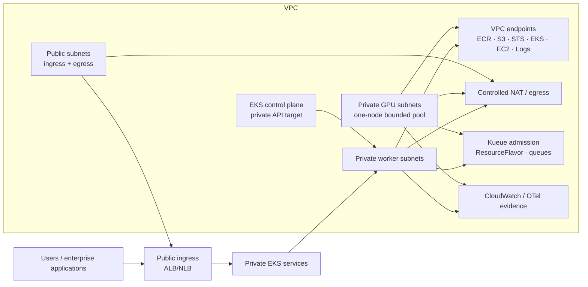

# Private EKS Reference Architecture for Enterprise AI and GPU Workloads

## Status

**YY-48 design complete; YY-49 Terraform source and YY-50 protected CI path
implemented; private-worker runtime validation remains pending.**

This document defines the target topology for the public Enterprise AI and GPU
architecture. The existing EKS sandbox remains a low-cost development profile
and is intentionally not treated as production-ready. The private variant is a
reviewed source and delivery path, not evidence that a private cluster or GPU
runtime is currently deployed.

## Why the separation matters

The current personal sandbox uses a small no-NAT network with public subnets to
keep development costs bounded. That is acceptable for source validation but
does not represent the preferred topology for enterprise worker capacity.

For an Enterprise AI platform, worker nodes and GPU nodes should not receive
public IP addresses. They should run in private subnets with explicit access to
AWS services, controlled outbound dependencies, workload identity, and
auditable operational evidence.

## Public sandbox versus private target

| Concern | Current development sandbox | Enterprise target |
| --- | --- | --- |
| Worker placement | Existing public subnets | Private worker and GPU subnets |
| EKS API | Restricted public access plus private access as configured | Private endpoint target |
| Egress | No-NAT low-cost path | VPC endpoints plus controlled NAT/egress |
| Image source | Approved digest-pinned image path | Prefer private ECR mirror and promotion evidence |
| CI network | GitHub-hosted workflow path where reachable | VPC-connected runner for private API operations |
| GPU | Source path only unless separately approved | Private GPU node group after worker validation |
| Claim | Development validation | Production-oriented reference architecture |

## Target topology



## Network design

### Public subnets

Public subnets contain only components that have a documented reason to be
publicly reachable:

- internet-facing ALB/NLB;
- controlled NAT gateways or an approved egress service;
- no EKS worker nodes;
- no GPU nodes;
- no internal data stores.

### Private subnets

Private subnets contain:

- EKS worker nodes;
- GPU node groups;
- Kueue workloads;
- internal services;
- internal observability components;
- private ECR access paths.

Private subnet route tables must not use an Internet Gateway as their default
route. Any external access must use a documented NAT or endpoint path.

## Endpoint and egress contract

The preferred baseline is endpoint-first:

| Service | Endpoint intent | Reason |
| --- | --- | --- |
| ECR API | Interface endpoint | Registry authentication and API calls |
| ECR DKR | Interface endpoint | Container layer pulls |
| S3 | Gateway endpoint | ECR layer storage and selected artifacts |
| STS | Interface endpoint | Web identity and short-lived credentials |
| EKS service API | `com.amazonaws.<region>.eks` interface endpoint | AWS EKS service operations from private nodes/runner |
| Kubernetes API | EKS private cluster endpoint and control-plane ENIs | Kubernetes API access from the VPC-connected delivery runner; not the EKS service endpoint |
| EC2 | Interface endpoint where required | Node and infrastructure API operations |
| CloudWatch Logs | Interface endpoint | Private log delivery |
| SSM Messages | Optional interface endpoint | Only for approved private debugging paths |

NAT is permitted only for dependencies that cannot use a VPC endpoint, such as
an approved public registry or package source. NAT access must be constrained by
security groups, route tables, DNS policy, egress allowlists, and evidence.

## Delivery-plane constraint

GitHub OIDC establishes AWS identity; it does not establish network access to a
private EKS API endpoint. Therefore:

- GitHub Actions remains the orchestration and approval plane;
- Kubernetes API operations for the private-control-plane profile run on a
  VPC-connected self-hosted runner or equivalent in-VPC build job;
- the runner uses short-lived OIDC-derived credentials;
- runner security groups and subnet placement are documented;
- the runner has approved outbound connectivity to GitHub Actions services for
  job reception, action downloads, OIDC exchange, logs, and artifacts through a
  controlled NAT, proxy, or equivalent in-VPC egress path;
- no long-lived AWS credentials are stored in GitHub;
- a GitHub-hosted runner may only be used for the intermediate private-worker
  profile when its network path is explicitly reviewed.

## Image promotion

A private GPU node should not depend implicitly on Public ECR reachability.

The preferred path is:

```text
Approved CUDA tag
  → digest resolution
  → architecture and nvidia-smi verification
  → private ECR promotion
  → image scan and lifecycle policy
  → private-node pull through ECR/S3 endpoints
```

The image digest, not the mutable tag, is the deployment input. A NAT-based
public image pull is an explicit exception and must appear in the cost and
security review.

Image-promotion evidence must show that the source digest and promoted digest
match, the target repository is private, the image scan gate passed, the
deployment references a digest rather than a mutable tag, and the private node
pulled through the approved ECR/S3 endpoint path (or records the approved NAT
exception). Public ECR reachability must never be inferred from a successful
deployment alone.

## GPU and Kueue boundary

The private GPU extension remains bounded:

- one on-demand GPU node maximum;
- `min=0`, `desired=0` outside an approved run, `max=1`;
- NVIDIA device plugin baseline;
- pinned Kueue chart;
- one synthetic CUDA smoke Job;
- no customer, employer, production, or model-training data;
- Kueue admission evidence before workload completion is claimed;
- separate stop and teardown decisions.

GPU capacity is added only after ordinary private-worker bootstrap, image pull,
endpoint reachability, and observability validation pass.

## Cost boundary

The private variant has costs that the current public sandbox intentionally
avoids:

- EKS control-plane hours;
- interface endpoint hourly and data-processing charges;
- NAT gateway or central egress costs;
- VPC-connected runner/build costs;
- CloudWatch and telemetry ingestion;
- private ECR storage and scanning;
- worker and GPU runtime;
- cross-AZ data transfer.

A separate monthly budget must be approved before apply. The existing USD 50
monthly sandbox budget and USD 20 daily GPU budget are not assumed to cover the
private variant. Budget alerts are evidence and governance controls, not hard
service caps; the workflow must still provide protected scale-to-zero and
separate teardown controls.

The protected CI contract uses these exact inputs before an apply:

- `PRIVATE_EKS_BUDGET_APPROVED=true`;
- `PRIVATE_EKS_MONTHLY_BUDGET_USD` set to the separately approved numeric
  ceiling;
- `PRIVATE_EKS_RUNNER_READY=true`;
- `PRIVATE_EKS_ENDPOINT_POLICY_READY=true`;
- an explicit apply confirmation matching the private-environment workflow.

The workflow must fail closed when any input is absent, malformed, or not
approved for the selected environment.

## Evidence and public-safety boundary

Public evidence may include:

- topology and control decisions;
- resource-class labels;
- endpoint categories;
- private-worker bootstrap result;
- image-promotion result;
- Kueue admission state;
- workload completion category;
- cost and stop-condition decisions.

Public evidence must not include:

- account IDs;
- role ARNs;
- VPC or subnet IDs;
- endpoints or kubeconfig;
- Terraform state or raw plans;
- credentials, tokens, prompts, customer data, or unredacted logs.

## Status wording

Use:

> Designed a private-subnet EKS target architecture with controlled egress,
> VPC endpoints, workload identity, private GPU placement, Kueue admission, and
> protected CI/CD delivery.

Only use “implemented” or “validated” after the corresponding Terraform and CI
evidence exists. The current public-subnet sandbox is not evidence of private
worker or private GPU runtime validation.
