# Three-Cloud Governed RAG Reference

## Purpose

This reference compares how AWS, Azure, and GCP can implement the same
enterprise RAG control contract. It is deliberately not a benchmark claiming
that one provider or model is universally better.

The portfolio sequence is **AWS live POC first**, then Azure and GCP
architecture mappings and optional small validations. All examples use only
synthetic, self-authored material.

## Shared Governed RAG Contract

```text
authenticated user or workload
        ↓
deterministic admission and source policy
        ↓
approved retrieval service and synthetic knowledge source
        ↓
grounded answer with citations — or explicit abstention
        ↓
evaluation, metadata-safe observability, cost ownership, and teardown
```

The model must not decide access, source retirement, approval, or execution.
Those are deterministic platform controls.

## Three RAG patterns used for comparison

```mermaid
flowchart TB
    subgraph P1[Direct provider RAG]
      C1[Client] --> B1[Bedrock / Azure / Vertex RAG API]
      B1 --> K1[Provider knowledge index]
      K1 --> O1[Cited answer or abstention]
    end

    subgraph P2[Gateway + Runtime + RAG]
      C2[Client] --> G2[Gateway / API boundary]
      G2 --> R2[Read-only runtime]
      R2 --> K2[Approved retrieval service]
      K2 --> O2[Sanitised citation contract]
    end

    subgraph P3[AgentCore-native extension]
      C3[Client] --> G3[Gateway]
      G3 --> A3[Bounded agent orchestration]
      A3 --> T3[Approved tools + retrieval + evaluation]
      T3 --> O3[Audited answer or human-approved action]
    end
```



| Pattern | Reusable boundary | Best fit | Main risk to control |
| --- | --- | --- | --- |
| Direct provider RAG | Provider API and knowledge index | Simple cited lookup and baseline comparison | Caller must implement identity, policy, sanitisation, and audit boundaries |
| Gateway + Runtime + RAG | Gateway, runtime, retrieval, and response contract | Enterprise read-only assistance with a stable platform boundary | More operational components and latency |
| AgentCore-native extension | Gateway, agent runtime, tools, evaluation, and approvals | Bounded planning or tool use across approved enterprise systems | Tool authority, non-deterministic behaviour, traceability, and cost |

The AWS P8i sandbox currently validates the second pattern. The first pattern
is retained as a direct provider preflight, while the third is an architecture
option only until a separate evaluation and approval scope is defined.

## Common Evaluation Set

Each implementation uses the same synthetic handbook and the same six outcomes:

| Scenario | Expected result |
| --- | --- |
| Active approved source | Cited answer |
| Insufficient evidence | Abstention |
| Retired source | Denied before retrieval |
| Disabled workload | Disabled before retrieval |
| Prompt-attack-shaped input | Denied or safely blocked |
| Direct runtime bypass | Denied before retrieval |

The comparison records only safe evidence: outcome, citation-present flag,
control decision, timestamp, and aggregate cost range. It excludes credentials,
endpoints, raw prompts, raw answers, and provider identifiers.

## Provider Mappings

| Control concern | AWS flagship POC | Azure mapping | GCP mapping |
| --- | --- | --- | --- |
| Entry boundary | AgentCore Gateway | Application/API entry with Entra-backed access | Application/API entry with IAM-backed access |
| Read-only runtime | AgentCore Runtime | Hosted application or agent runtime | Hosted application or agent runtime |
| Retrieval | Bedrock Knowledge Bases | Azure AI Search / Foundry RAG | Vertex AI RAG Engine |
| Grounding result | Cited answer or abstention | Grounded response with citations | Grounded response with citations |
| Deterministic controls | Gateway policy, IAM, source lifecycle | Identity, application policy, source lifecycle | IAM, application policy, source lifecycle |
| Evidence | Metadata-safe logs and evaluation results | Equivalent audit/evaluation evidence | Equivalent audit/evaluation evidence |

The named services are starting points, not a claim that the products are
identical. The portable asset is the control contract and evidence model.

## Fair Comparison Rules

1. Keep the corpus, questions, expected outcomes, and citation requirement
   unchanged across providers.
2. Do not compare raw model quality until model family, retrieval settings,
   region, cost boundary, and evaluation method are controlled and recorded.
3. Record architecture mappings separately from live validation evidence.
4. Treat deployment, provider access, and teardown as provider-specific gates.
5. Prefer reproducible operational evidence over screenshots or product claims.

## Retrieval Maturity and Selection

The right question is not which retrieval pattern is most advanced. It is what
kind of reasoning the use case actually requires.

| Pattern | Use when | Do not add it merely because |
| --- | --- | --- |
| Governed RAG | An approved source contains a direct, citeable answer | An agentic label sounds more advanced |
| GraphRAG | The answer depends on explicit entity relationships or multi-hop connections | Semantic retrieval has not yet been evaluated |
| Agentic RAG | A bounded planner must compare, decompose, or repeat retrieval across approved sources | The model should be allowed to take action |

For this portfolio, the current POC remains **Governed RAG**. It proves source
lifecycle, citations-or-abstention, deterministic policy, evaluation, and
operational evidence before adding graph construction, iterative planning, or
tool access.

If a later Agentic RAG exercise is justified, the agent may propose a
retrieval plan only. It must remain a governed workload identity with approved
sources, bounded iteration, traceable decisions, explicit evaluation, and no
autonomous writes or production actions.

## Current Evidence Status

| Provider | Status | Next evidence |
| --- | --- | --- |
| AWS | Live synthetic AgentCore RAG POC with direct-preflight and Gateway evidence | Repeat only for a changed evaluation goal; teardown remains separately gated |
| Azure | Architecture mapping planned | Confirm service path, region, access, cost, and teardown before any validation |
| GCP | Architecture mapping planned | Confirm service path, region, access, cost, and teardown before any validation |

## Official Starting Points

- [Amazon Bedrock Knowledge Bases retrieval](https://docs.aws.amazon.com/bedrock/latest/userguide/kb-how-retrieval.html)
- [Azure AI Search RAG overview](https://learn.microsoft.com/en-us/azure/search/retrieval-augmented-generation-overview)
- [Vertex AI RAG Engine quickstart](https://cloud.google.com/vertex-ai/generative-ai/docs/rag-engine/rag-engine-quickstart)

## Portfolio and Article Angle

> Designed a provider-neutral governed RAG reference architecture with one
> shared control and evaluation contract, an AWS AgentCore flagship POC, and
> evidence-based Azure and GCP mappings.

The repository document is the primary technical article. A LinkedIn post
should summarise one insight and link to this reference; it should not claim
production deployment or a cross-cloud quality winner.
