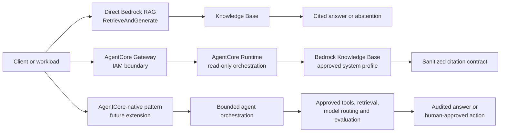

# P8i AgentCore RAG — key process record

> Private engineering note. Synthetic data only. No customer, employer, credential, or production data is used.

## Outcome

The sandbox now proves an end-to-end, IAM-authenticated AgentCore Gateway RAG path through GitHub Actions, Terraform, CloudFormation, Bedrock Knowledge Bases, and an approved Claude Haiku 4.5 system inference profile.

The final acceptance criteria are:

- direct Bedrock `RetrieveAndGenerate` preflight succeeds;
- Gateway invocation returns HTTP 200 and `outcome=answer`;
- at least one active citation is returned;
- `citationPresent=true` and `sourceLifecycle=active`;
- no provider error, ARN, prompt, or credential is exposed to the caller.

## Architecture decisions

1. **CI/CD only** — GitHub Actions is the only deployment and verification path. AWS access uses GitHub OIDC; no local AWS mutation or console click-ops is part of the process.
2. **Terraform as the control plane** — Terraform manages the Runtime, Gateway, Target, IAM policies, remote state, and outputs.
3. **CloudFormation inside Terraform for data foundation** — CloudFormation manages the S3 source bucket, S3 Vectors bucket/index, Knowledge Base, and data source where provider coverage is still evolving.
4. **Gateway-only external entry** — the test invokes the IAM-protected `governed-rag-runtime` Gateway target, not the Runtime directly.
5. **System inference profile** — the existing approved regional Claude Haiku 4.5 system profile is used directly. A new application inference profile is not created.
6. **Fail-closed responses** — the Runtime returns an answer only with valid retrieval evidence; otherwise it returns a bounded reason code without provider internals.

## Key process

```text
Review code and policy
  -> CI validation and security checks
  -> Bootstrap plan creates a non-executing change set
  -> Explicit change-set approval
  -> Bootstrap apply through OIDC
  -> Terraform deploy plan (0 add / 2 change / 0 destroy)
  -> Explicit deploy approval
  -> Runtime/Gateway deployment
  -> Synthetic ingestion and direct Bedrock preflight
  -> IAM-authenticated Gateway invoke
  -> Evidence artifact and private note update
```

## Important incidents and decisions

### 1. Vector-index creation race

The first data-foundation apply raced S3 Vectors bucket and index creation. `DependsOn: VectorBucket` was added to make the dependency explicit.

### 2. Metadata configuration replacement

Changing filterable metadata on a named S3 Vectors index required replacement. The sandbox versioned the vector index and Knowledge Base names so CloudFormation could create the corrected empty resources safely.

### 3. Gateway target compatibility

AgentCore Runtime targets do not use the MCP-style credential provider block. The target uses the Runtime-compatible empty `gateway_iam_role {}` shape and omits the invalid deployment-version qualifier.

### 4. RAG generation-model failure

The first implementation created an application inference profile. The approved Claude Haiku 4.5 foundation model does not support on-demand application-profile creation, so the design changed to the existing system inference profile.

### 5. Least-privilege IAM convergence

Bedrock required both the inference-profile ARN and the two documented regional foundation-model ARNs for cross-Region inference. The CI preflight additionally required `bedrock:GetInferenceProfile` on the exact system profile. No wildcard model/profile permission was added.

### 6. Observability apply permission gap

The first protected observability apply ([run 32158283596](https://github.com/afaryy/cloudai-platform/actions/runs/32158283596)) completed OIDC authentication and Terraform planning, but the apply was denied by AWS for `cloudwatch:PutDashboard` and `cloudwatch:PutMetricAlarm`. No dashboard or alarm was created, and no sandbox resource was deleted.

The remediation is being kept in the CloudFormation-managed bootstrap policy rather than applied through click-ops. The first remediation change set rolled back because the existing Terraform execution role inline policy was already at AWS's 10,240-byte maximum. The corrected design moves AgentCore RAG Terraform permissions into dedicated managed policies; the existing `AgentCoreRagFunctionalPolicy` remains runtime-only. This keeps EKS/backend permissions separate from AgentCore lifecycle permissions and includes the named dashboard and two alarms (`Get/Put/DeleteDashboard(s)` and `Describe/Put/DeleteAlarms`). A fresh bootstrap change-set review and apply are required before retrying the AgentCore deploy workflow.

The approved bootstrap apply run `32202901167` exposed a separate AWS quota: the single `AgentCoreRagTerraformPolicy` document exceeded the 6,144-byte customer-managed policy limit. The follow-up design keeps core AgentCore/ECR/role lifecycle in `agentcore-rag-terraform` and moves the RAG data stack, synthetic source documents and CloudWatch observability into `agentcore-rag-data`. Both managed policies remain CloudFormation-controlled and attached to the Terraform role; no resource teardown is part of this recovery.

The first post-split observability deploy (`32203948213`) created the dashboard, then failed on Terraform's alarm tag refresh because `cloudwatch:ListTagsForResource` was not yet allowed. The remediation adds this single read action to the two named alarm ARNs; the dashboard and existing sandbox resources remain in place.

The failed provider read tainted both alarm instances in Terraform state. A dedicated `observability-recover` CI/CD mode now verifies the existing alarm names, removes only those tainted markers, and fails closed if the resulting plan contains any delete action. This is state recovery, not resource deletion.

The initial recovery run found the tainted instances but omitted the `[0]` count index in the `terraform untaint` addresses. The workflow was corrected to target the exact indexed alarm instances.

The corrected recovery run ([run 32207928683](https://github.com/afaryy/cloudai-platform/actions/runs/32207928683)) verified that both named alarms already existed, untainted only the indexed alarm instances, and produced a recovery plan with `No changes`. Its fail-closed guard also confirmed that the plan contained zero delete actions. The follow-up deploy-plan ([run 32208008899](https://github.com/afaryy/cloudai-platform/actions/runs/32208008899)) refreshed the dashboard and both alarms successfully and again returned `No changes`. The sandbox was preserved throughout.

## Final evidence

| Evidence | Result |
|---|---|
| Bootstrap policy apply | [run 32144047070](https://github.com/afaryy/cloudai-platform/actions/runs/32144047070) — success |
| Runtime deploy apply | [run 32141185366](https://github.com/afaryy/cloudai-platform/actions/runs/32141185366) — success |
| First Gateway proof | [run 32143179818](https://github.com/afaryy/cloudai-platform/actions/runs/32143179818) — answer + citation; preflight exposed missing profile-read permission |
| Final end-to-end proof | [run 32144157616](https://github.com/afaryy/cloudai-platform/actions/runs/32144157616) — direct preflight succeeded, Gateway HTTP 200, answer + active citation |
| IAM remediation code | [PR #169](https://github.com/afaryy/cloudai-platform/pull/169) — merged |
| Closure note | [PR #170](https://github.com/afaryy/cloudai-platform/pull/170) — merged |
| Observability policy update | [bootstrap apply run 32205074688](https://github.com/afaryy/cloudai-platform/actions/runs/32205074688) — CloudFormation update succeeded |
| Observability state recovery | [run 32207928683](https://github.com/afaryy/cloudai-platform/actions/runs/32207928683) — taints cleared, zero-delete plan |
| Final observability plan | [run 32208008899](https://github.com/afaryy/cloudai-platform/actions/runs/32208008899) — dashboard and alarms reconciled, no changes |

The final Gateway response contained the synthetic source citation `synthetic://agentcore-poc-handbook#retrieval`, with `citationPresent=true` and `sourceLifecycle=active`.

## Security and operations boundaries

- The source and vector stores are synthetic-only and tagged for teardown.
- Gateway authorization is AWS IAM; no anonymous endpoint is used.
- Runtime, tool, model, network, and data permissions are scoped to the sandbox.
- The CI role does not receive direct Runtime invocation permission.
- Runtime error responses are sanitized; detailed diagnostics remain in controlled CI logs.
- Every apply requires a reviewed plan, GitHub Environment approval, OIDC credentials, and an exact confirmation phrase.
- Evidence artifacts are retained temporarily and contain only synthetic request/response data.

## RAG pattern comparison — item 2 complete

The POC now has a small pattern comparison to keep the live evidence separate
from future architecture options:



| Pattern | Role in this portfolio | Strength | Trade-off | Evidence level |
| --- | --- | --- | --- | --- |
| Direct Bedrock RAG | Provider-level baseline and preflight | Fewest components and a clear retrieval/model path | The caller owns authentication, response sanitisation, policy enforcement, and operational boundaries | Live direct `RetrieveAndGenerate` preflight |
| Gateway + Runtime + RAG | Current AWS P8i implementation | Adds an IAM entry boundary, read-only runtime orchestration, and a reusable sanitised response contract | More components and some additional latency/operations | Live end-to-end Gateway evidence in [run 32144157616](https://github.com/afaryy/cloudai-platform/actions/runs/32144157616) |
| AgentCore-native | Future extension, not a current deployment claim | Supports bounded tools, multi-step orchestration, evaluation, tracing, and human approval | Greater identity, tool-permission, evaluation, and cost complexity | Architecture option only |

The selection rule is deliberately conservative: use direct Bedrock RAG as a
provider baseline, use Gateway + Runtime when a reusable enterprise boundary
is needed, and add AgentCore-native orchestration only when the use case
requires bounded planning or tool use.

## Behavioural evaluation cases — item 3 complete

The canonical synthetic evaluation pack is
[`behavioral-evaluation-cases.json`](../../shared/examples/agentcore-rag-poc/behavioral-evaluation-cases.json).
It records the expected outcome, deterministic reason code, control boundary,
and evidence level for five failure or escalation behaviours:

| Case | Expected result | Boundary | Current evidence |
| --- | --- | --- | --- |
| Citation missing | Abstain with `insufficient_evidence` | Retrieval | Local Runtime contract test |
| Stale source | Deny with `knowledge_source_retired` | Source lifecycle | Local admission contract test |
| Provider timeout | Abstain with `retrieval_unavailable` | Provider failure | Local sanitisation contract test |
| Denied tool | Deny with `tool_not_allowed` | Tool authorisation | Existing AgentOps reliability contract |
| Human-approval boundary | Pause with `human_approval_required` | Human approval | Existing AgentOps reliability contract |

The first three cases exercise the read-only RAG Runtime boundary. The last
two deliberately remain AgentOps contract evidence: the current deployed POC
does not execute tools or make approval decisions. All five are synthetic,
repeatable, metadata-safe, and suitable for future provider comparisons.

## Framework-neutral evaluation telemetry gate

The behavioural pack is now executable through a framework-neutral local gate.
The gate models all six fixed scenarios—the five failure or escalation cases
above plus the successful cited-answer baseline—using equivalent
OpenTelemetry GenAI and OpenInference fixtures. Recognized instrumentation
scopes, `session.id`, invoke-agent spans, inference spans, and execute-tool
correlation are normalized before deterministic scores are applied.

The `strict-v1` profile requires `1.0` for telemetry compatibility, trace
completeness, tool-trajectory accuracy, behavioural outcome, and goal success.
The pull-request job runs without AWS credentials, does not call AWS, and
retains only a metadata-safe report. This work is locally contract-tested; it
does not prove OTLP delivery, CloudWatch trace ingestion, AgentCore managed
evaluation, or production agent quality. Those remain a separately approved
protected provider-parity lane described in the
[evaluation telemetry runbook](./agent-evaluation-telemetry-runbook.md).

## Current next work

1. Keep the sandbox deployed for interview demonstrations while monitoring cost and quotas.
2. **Complete** — keep the pattern comparison above aligned with the live AWS evidence and future AgentCore-native scope.
3. **Complete** — maintain the five-case behavioural evaluation pack and keep evidence levels explicit.
4. **Complete** — compare AWS, Azure, and GCP RAG control planes using the same security, governance, observability, FinOps, teardown, and behavioural-evaluation criteria. AWS remains live evidence; Azure and GCP are public-documentation mappings pending any separately approved validation.
5. **Deferred** — keep the sandbox deployed for learning and interview demonstrations. Review teardown only through a separate plan and fresh confirmation when the learning/demo cycle is complete.

## Observability slice — YY-34 complete

This implementation slice adds a bounded observability contract without
introducing a second monitoring stack:

- Runtime emits metadata-safe structured completion events using CloudWatch
  Embedded Metric Format (EMF).
- Metrics use bounded dimensions (`Environment`, `Route`, `Outcome`); the
  request ID remains a log field and is not a metric dimension.
- Terraform defines the CloudWatch dashboard and alarms with no notification
  actions in the personal sandbox.
- The Terraform execution role receives AgentCore lifecycle permissions through
  a dedicated managed policy, keeping the larger EKS/backend inline policy
  below AWS's 10,240-byte limit.
- GitHub Actions runs the Runtime contract tests and Terraform tests.
- Prometheus, Grafana, SIEM integration, automatic incident remediation, and
  full AgentCore/ADOT trace verification remain future steps.

The first live apply attempt was blocked by the missing bootstrap permissions
described above. The policy was then updated through the protected bootstrap
workflow, and state recovery was completed without deleting or recreating the
existing alarms. The dashboard and alarms are now deployed and reconciled in
Terraform. A future synthetic Gateway invoke can add real EMF datapoints for
the dashboard; this is an evidence-enrichment step, not a prerequisite for
the deployed observability control plane. No teardown is performed as part of
this work.

## Three-cloud control-plane comparison — item 4 complete

The public-safe comparison is recorded in
[`three-cloud-governed-rag-reference.md`](../architecture/three-cloud-governed-rag-reference.md).
It uses one matrix for entry identity, retrieval/grounding, source permissions
and lifecycle, deterministic admission, runtime/tool boundaries,
observability/evaluation, FinOps, and teardown.

The comparison deliberately separates evidence levels:

- **AWS:** live synthetic AgentCore Gateway + Runtime + Bedrock evidence.
- **Azure:** architecture mapping using Azure AI Search, Entra/RBAC, managed identities, Azure Monitor/Application Insights, and Foundry tracing/evaluation.
- **GCP:** architecture mapping using Vertex AI RAG Engine/grounding/evaluation, IAM/workload identity, Cloud Logging/Monitoring, and explicit application/data-layer permission controls.

The same five behavioural cases are used across providers:
`citation missing`, `stale source`, `provider timeout`, `denied tool`, and
`human-approval boundary`. The portable evidence is limited to outcome,
reason code, citation-present flag, control decision, timestamp, latency
bucket, and aggregate cost boundary; credentials, raw prompts, raw answers,
endpoints, and provider internals are excluded.

No provider ranking is claimed. The next optional work is a separately gated
Azure or GCP validation only after service path, region, access, quota, cost,
and teardown are approved.

## Teardown decision — deferred

The AWS sandbox remains deployed intentionally for the current learning and
interview-demonstration cycle. No destroy, delete, or other AWS mutation is
authorized by this decision. A future teardown must be proposed as a separate
reviewed plan that identifies resources, expected cost reduction, retained
evidence, and recovery limitations, followed by a fresh explicit confirmation.
