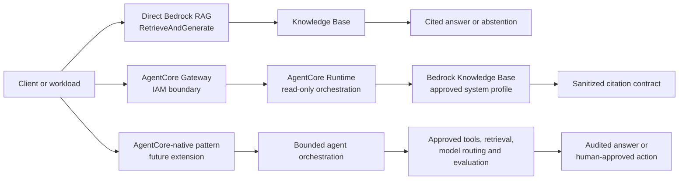

# P8i AgentCore RAG — key process record

> Private engineering note. Synthetic data only. No customer, employer, credential, or production data is used.

## Outcome

The sandbox now proves an end-to-end, IAM-authenticated AgentCore Gateway RAG path through GitHub Actions, Terraform, CloudFormation, Bedrock Knowledge Bases, and an approved Claude Haiku 4.5 system inference profile.

The final acceptance criteria are:

- direct Bedrock `RetrieveAndGenerate` preflight succeeds;
- Gateway invocation returns HTTP 200 and `outcome=answer`;
- at least one active citation is returned;
- `citationPresent=true` and `sourceLifecycle=active`;
- no provider error, ARN, prompt, or credential is exposed to the caller.

## Architecture decisions

1. **CI/CD only** — GitHub Actions is the only deployment and verification path. AWS access uses GitHub OIDC; no local AWS mutation or console click-ops is part of the process.
2. **Terraform as the control plane** — Terraform manages the Runtime, Gateway, Target, IAM policies, remote state, and outputs.
3. **CloudFormation inside Terraform for data foundation** — CloudFormation manages the S3 source bucket, S3 Vectors bucket/index, Knowledge Base, and data source where provider coverage is still evolving.
4. **Gateway-only external entry** — the test invokes the IAM-protected `governed-rag-runtime` Gateway target, not the Runtime directly.
5. **System inference profile** — the existing approved regional Claude Haiku 4.5 system profile is used directly. A new application inference profile is not created.
6. **Fail-closed responses** — the Runtime returns an answer only with valid retrieval evidence; otherwise it returns a bounded reason code without provider internals.

## Key process

```text
Review code and policy
  -> CI validation and security checks
  -> Bootstrap plan creates a non-executing change set
  -> Explicit change-set approval
  -> Bootstrap apply through OIDC
  -> Terraform deploy plan (0 add / 2 change / 0 destroy)
  -> Explicit deploy approval
  -> Runtime/Gateway deployment
  -> Synthetic ingestion and direct Bedrock preflight
  -> IAM-authenticated Gateway invoke
  -> Evidence artifact and private note update
```

## Important incidents and decisions

### 1. Vector-index creation race

The first data-foundation apply raced S3 Vectors bucket and index creation. `DependsOn: VectorBucket` was added to make the dependency explicit.

### 2. Metadata configuration replacement

Changing filterable metadata on a named S3 Vectors index required replacement. The sandbox versioned the vector index and Knowledge Base names so CloudFormation could create the corrected empty resources safely.

### 3. Gateway target compatibility

AgentCore Runtime targets do not use the MCP-style credential provider block. The target uses the Runtime-compatible empty `gateway_iam_role {}` shape and omits the invalid deployment-version qualifier.

### 4. RAG generation-model failure

The first implementation created an application inference profile. The approved Claude Haiku 4.5 foundation model does not support on-demand application-profile creation, so the design changed to the existing system inference profile.

### 5. Least-privilege IAM convergence

Bedrock required both the inference-profile ARN and the two documented regional foundation-model ARNs for cross-Region inference. The CI preflight additionally required `bedrock:GetInferenceProfile` on the exact system profile. No wildcard model/profile permission was added.

## Final evidence

| Evidence | Result |
|---|---|
| Bootstrap policy apply | [run 32144047070](https://github.com/afaryy/cloudai-platform/actions/runs/32144047070) — success |
| Runtime deploy apply | [run 32141185366](https://github.com/afaryy/cloudai-platform/actions/runs/32141185366) — success |
| First Gateway proof | [run 32143179818](https://github.com/afaryy/cloudai-platform/actions/runs/32143179818) — answer + citation; preflight exposed missing profile-read permission |
| Final end-to-end proof | [run 32144157616](https://github.com/afaryy/cloudai-platform/actions/runs/32144157616) — direct preflight succeeded, Gateway HTTP 200, answer + active citation |
| IAM remediation code | [PR #169](https://github.com/afaryy/cloudai-platform/pull/169) — merged |
| Closure note | [PR #170](https://github.com/afaryy/cloudai-platform/pull/170) — merged |

The final Gateway response contained the synthetic source citation `synthetic://agentcore-poc-handbook#retrieval`, with `citationPresent=true` and `sourceLifecycle=active`.

## Security and operations boundaries

- The source and vector stores are synthetic-only and tagged for teardown.
- Gateway authorization is AWS IAM; no anonymous endpoint is used.
- Runtime, tool, model, network, and data permissions are scoped to the sandbox.
- The CI role does not receive direct Runtime invocation permission.
- Runtime error responses are sanitized; detailed diagnostics remain in controlled CI logs.
- Every apply requires a reviewed plan, GitHub Environment approval, OIDC credentials, and an exact confirmation phrase.
- Evidence artifacts are retained temporarily and contain only synthetic request/response data.

## RAG pattern comparison — item 2 complete

The POC now has a small pattern comparison to keep the live evidence separate
from future architecture options:



| Pattern | Role in this portfolio | Strength | Trade-off | Evidence level |
| --- | --- | --- | --- | --- |
| Direct Bedrock RAG | Provider-level baseline and preflight | Fewest components and a clear retrieval/model path | The caller owns authentication, response sanitisation, policy enforcement, and operational boundaries | Live direct `RetrieveAndGenerate` preflight |
| Gateway + Runtime + RAG | Current AWS P8i implementation | Adds an IAM entry boundary, read-only runtime orchestration, and a reusable sanitised response contract | More components and some additional latency/operations | Live end-to-end Gateway evidence in [run 32144157616](https://github.com/afaryy/cloudai-platform/actions/runs/32144157616) |
| AgentCore-native | Future extension, not a current deployment claim | Supports bounded tools, multi-step orchestration, evaluation, tracing, and human approval | Greater identity, tool-permission, evaluation, and cost complexity | Architecture option only |

The selection rule is deliberately conservative: use direct Bedrock RAG as a
provider baseline, use Gateway + Runtime when a reusable enterprise boundary
is needed, and add AgentCore-native orchestration only when the use case
requires bounded planning or tool use.

## Current next work

1. Keep the sandbox deployed for interview demonstrations while monitoring cost and quotas.
2. **Complete** — keep the pattern comparison above aligned with the live AWS evidence and future AgentCore-native scope.
3. Add behavioural evaluation cases: citation missing, stale source, provider timeout, denied tool, and human-approval boundary.
4. Compare AWS, Azure, and GCP RAG control planes using the same security, governance, observability, and FinOps criteria.
5. Review teardown only through a separate plan and confirmation when the learning/demo cycle is complete.
