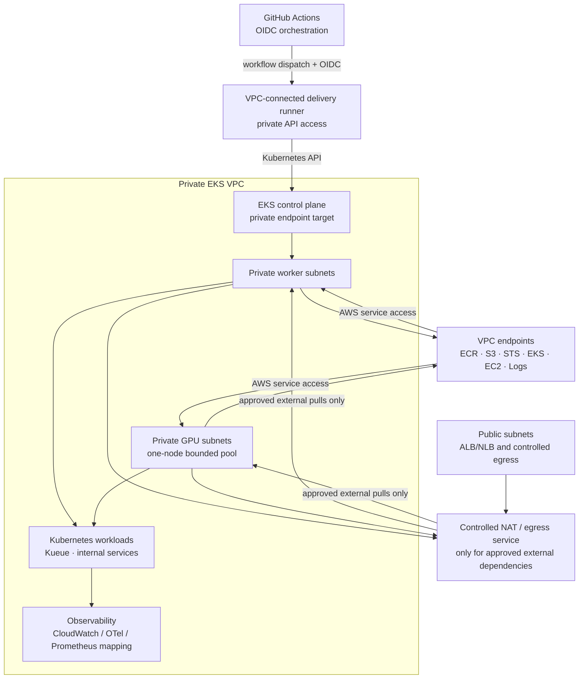

# Private EKS Reference Architecture Design

**Status:** Design complete for YY-48; no AWS resources are created by this document.

**Parent work item:** YY-47 / YY-48

## Goal

Define and later implement a production-oriented private-node EKS reference
variant for Enterprise AI and GPU workloads without mutating or deleting the
existing low-cost public-subnet sandbox.

The public-subnet sandbox remains useful for inexpensive Terraform, GitHub
Actions, Helm, Argo CD, and source-path validation. It is not the target
topology for the public Enterprise AI architecture.

## Decisions

### Decision 1: Private workers are the production baseline

EKS worker nodes, GPU nodes, Kueue workloads, and internal services belong in
private subnets. Public subnets are reserved for internet-facing ingress and
controlled egress components.

Nodes must not receive public IP addresses. Outbound access must use explicit
VPC endpoints, a controlled NAT path, or both.

### Decision 2: Separate implementation profiles

| Profile | Purpose | Network posture | Claim |
| --- | --- | --- | --- |
| Development sandbox | Low-cost source and integration validation | Existing public-subnet workers, no-NAT baseline, restricted EKS API endpoint | Implemented sandbox only |
| Enterprise reference variant | Production-oriented AI and GPU foundation | Private workers/GPU nodes, controlled egress, private API target, in-VPC delivery path | Design first; runtime only after evidence |

The first private implementation must be a separate Terraform environment and
remote state key. It must not reuse the existing public sandbox state.

### Decision 3: Private worker and private control-plane profiles are distinct

There are two private variants:

1. **Private-worker profile:** private worker/GPU subnets with the EKS API
   endpoint still reachable through a tightly controlled public path while the
   delivery-plane migration is completed.
2. **Private-control-plane profile:** private worker/GPU subnets and private
   EKS API endpoint, operated from a VPC-connected GitHub Actions runner or
   equivalent in-VPC execution plane.

The private-control-plane profile is the final reference target. A
GitHub-hosted runner cannot directly reach a private EKS API endpoint. OIDC
authenticates the runner to AWS but does not provide network reachability.

### Decision 4: Endpoint-first egress with an explicit NAT fallback

The preferred private-node design uses a gateway endpoint for S3 and interface
endpoints for the AWS services required by the selected node and observability
features. The baseline endpoint set is:

- ECR API
- ECR Docker registry
- S3 gateway
- STS
- EKS
- EC2
- CloudWatch Logs

SSM Messages is added only when the private execution/debugging path requires
it. Endpoint security groups and endpoint policies are least-privilege and
documented.

NAT is an explicit fallback for dependencies that cannot use VPC endpoints,
including public package registries or public ECR images. Production designs
should use multi-AZ egress or a centralised egress service; a single NAT is
only a bounded development compromise and must be called out as a resilience
limitation.

### Decision 5: Public CUDA images must not be an implicit private-node dependency

The GPU POC uses a digest-pinned CUDA image. Private nodes must either:

- pull it through an explicitly approved NAT path; or
- mirror the verified digest into a private ECR repository and pull through
  ECR/S3 VPC endpoints.

The preferred enterprise pattern is a private ECR mirror with immutable digest
verification, image scanning, lifecycle policy, and a documented promotion
record. A Public ECR reference alone does not prove private-subnet reachability.

### Decision 6: Cost is a gate, not a reason to weaken the target architecture

The private variant must have a separate cost estimate before apply. The
existing monthly sandbox budget and daily GPU budget are not assumed to cover
additional NAT, VPC endpoint, EKS control-plane, observability, storage, or
runner costs.

The private variant cannot be applied until:

- fixed and variable cost components are listed;
- a monthly budget is explicitly approved;
- GPU daily guardrails remain enabled before GPU capacity is added;
- the stop and teardown owner is documented;
- the plan proves that the existing public sandbox is unaffected.

## Target architecture



## Security and governance contract

| Boundary | Required control | Evidence |
| --- | --- | --- |
| Network | Private route tables, no public IP on workers, explicit egress | Terraform plan and sanitised route/endpoint checks |
| Identity | GitHub OIDC, node role least privilege, workload identity for applications | IAM policy tests and CI identity evidence |
| Kubernetes API | Private endpoint target with VPC-connected delivery runner | Runner reachability and API access evidence |
| Images | Immutable digest, approved registry, private ECR mirror where required | Digest verification and image-promotion evidence |
| Data | Synthetic data by default; explicit classification before access | Workload contract and policy result |
| GPU capacity | One-node maximum, scale-to-zero outside approved run | Terraform variables, budget guardrail and stop evidence |
| Admission | Kueue ResourceFlavor, ClusterQueue and LocalQueue; no implicit borrowing | Admission evidence and contract tests |
| Observability | Metadata-safe metrics and logs; no prompts, secrets or customer data | Sanitised artifact and retention configuration |
| Cost | Monthly and daily budgets before capacity is enabled | Budget evidence and preflight gate |
| Retirement | Separate stop/teardown plan and confirmation | Reviewed plan, post-action verification and notes |

## Egress decision matrix

| Option | Use | Benefits | Trade-offs | Decision |
| --- | --- | --- | --- | --- |
| Endpoint-first | AWS service access from private nodes | Lower recurring data-path exposure; explicit policies | More endpoints and configuration | Recommended baseline |
| Single NAT | Bounded development fallback | Simple access to public registries and package sources | Recurring cost, single-AZ dependency, broad egress risk | Only with explicit exception |
| Multi-AZ NAT or central egress | Production resilience | Better availability and central policy | Higher cost and more network design | Target for production scale |
| Public worker subnets | Existing low-cost sandbox only | Lowest setup complexity | Public IP exposure and weaker production posture | Not the target architecture |

## Cost boundary

The cost model must separate:

### Fixed or semi-fixed costs

- EKS control-plane hours;
- NAT gateways or central egress components;
- interface endpoint hourly charges;
- VPC endpoint data processing;
- private delivery runner or VPC-connected build execution;
- CloudWatch log retention and metrics;
- private ECR storage and image scanning;
- Terraform backend and lock storage.

### Variable costs

- worker node hours;
- GPU node hours;
- cross-AZ data transfer;
- NAT data processing;
- image and artifact transfer;
- observability ingestion;
- Kueue workload runtime;
- runner/build minutes.

### Required gates

1. Produce a pricing estimate using the selected region and exact services.
2. Set a separate private-variant monthly budget before apply.
3. Keep the existing GPU daily budget enabled before any GPU node is desired.
4. Use tags for `Project`, `Environment`, `DataScope`, `ManagedBy`, and
   `CostBoundary`.
5. Record a stop condition for idle, failed, or over-budget capacity.
6. Do not treat an alert as a hard cap; the workflow must still provide a
   protected scale-to-zero path.

## Delivery model

All changes follow:

```text
Design → Terraform source tests → GitHub Actions plan
→ protected approval → apply → metadata-safe validation
→ scale-to-zero / separate teardown decision
```

No console-created subnets, node groups, endpoints, IAM roles, or Kubernetes
objects are part of the target implementation.

## Non-goals

- No modification or deletion of the existing public-subnet sandbox.
- No HyperPod, Slurm, HPC fabric, data-centre deployment, or hyperscale GPU
  fleet.
- No customer, employer, production, or sensitive data.
- No claim of private runtime completion before CI evidence exists.

## Evidence required before claiming implementation

- Terraform source validation and tests;
- isolated remote backend and plan evidence;
- private worker bootstrap evidence;
- ECR/S3/STS/EKS/EC2/CloudWatch access evidence;
- no-public-IP and route/endpoint checks;
- GitHub OIDC and delivery-runner reachability evidence;
- ordinary workload scheduling evidence;
- private GPU/Kueue evidence only after the ordinary path passes;
- budget, stop and teardown evidence.
