# Human-Owned Supplier Evidence Adapter and Review Workflow Design

**Linear:** YY-65

**Status:** Sectioned design approved; written specification under review

**Date:** 5 September 2026

## 1. Purpose

Define a provider-neutral, human-owned path for turning controlled supplier
evidence into metadata-only records that the existing deterministic supplier
readiness and workload-admission evaluators can consume.

The design closes the gap between an external evidence source and the local
YY-63/YY-64 contracts without allowing a parser, adapter, model, or workflow
tool to approve evidence or author a final readiness decision.

The path must:

- quarantine and validate untrusted evidence input;
- normalize only the metadata required by a closed contract;
- bind human review to the exact candidate digest and version;
- preserve separation between submission, review, approval, revocation,
  deterministic evaluation, and runtime authority;
- publish only immutable, versioned, metadata-only evidence records;
- fail closed on authenticity, redaction, schema, freshness, role, audit, and
  registry failures; and
- project approved records into the existing deterministic supplier assessment
  without changing YY-64 decision logic.

This is a design for a local synthetic implementation. It does not authorize a
real supplier connection, raw-document ingestion, procurement approval,
assurance claim, cloud mutation, workload deployment, or runtime access.

## 2. Context and Existing Boundary

The repository already provides:

- a closed supplier-assessment schema with seven evidence families;
- deterministic readiness evaluation with explicit time, freshness, expiry,
  revocation, remediation, and external-requirement boundaries;
- versioned supplier-readiness decisions that replay exactly;
- conditional human-acceptance metadata for bounded conditional outcomes; and
- a workload-admission evaluator that replays and re-evaluates the supplier
  decision before emitting a metadata-only admission result.

Those contracts currently use synthetic, hand-authored metadata. They do not
define how an untrusted evidence source becomes an approved input record. This
design adds that upstream boundary while preserving the existing evaluator as
the only component that calculates supplier readiness.

The design is informed by the
[Enterprise AI Framework Benchmark](../../architecture/enterprise-ai-framework-benchmark.md),
which maps accountability, governance, evidence lifecycle, platform,
infrastructure, and operational expectations across provider-neutral and
provider-specific sources. It is not a compliance crosswalk or certification.

## 3. Scope

### 3.1 Included

- ports-and-adapters interfaces for evidence intake, review, registry, audit,
  and YY-64 projection;
- one future synthetic manifest adapter using generic metadata;
- closed candidate, review, and evidence-record contracts;
- deterministic identity and idempotency boundaries;
- a human-review state machine and role constraints;
- freshness, revocation, supersession, and reassessment behavior;
- retention-policy references and immutable audit events;
- metadata-safe operational signals; and
- positive, negative, transition, replay, and migration test requirements.

### 3.2 Excluded

- real object-storage, document-management, procurement, assurance, ticketing,
  identity-provider, or supplier API integration;
- storage of reports, questionnaires, contracts, signatures, credentials,
  prompts, model output, or other raw evidence;
- OCR, generative extraction, semantic interpretation, or autonomous approval;
- vendor selection, contact, endorsement, procurement, legal interpretation,
  or certification;
- persistent production workflow infrastructure, queues, Kafka, or SQS;
- notifications, automatic remediation, or automatic validity extension;
- Kubernetes, GPU, scheduler, workload execution, or cloud admission authority;
  and
- modification of YY-63 readiness or YY-64 workload-admission decision rules.

## 4. Architecture and Trust Boundaries

```text
Controlled raw-evidence source
  -> quarantined evidence-source port
  -> synthetic evidence adapter
  -> schema, authenticity, freshness, and redaction validation
  -> immutable Evidence Candidate
  -> human review workflow
  -> authoritative audit write + metadata-only evidence registry
  -> current-evidence projection into the existing supplier assessment
  -> YY-63 deterministic supplier readiness evaluator
  -> YY-64 deterministic workload admission evaluator
```



```mermaid
flowchart LR
    source["Controlled source\nraw evidence stays here"]

    subgraph quarantine["Untrusted intake boundary"]
      port["Evidence-source port"]
      adapter["Synthetic manifest adapter"]
      validation["Closed schema\nAuthenticity\nFreshness\nRedaction"]
      candidate["Immutable\nEvidence Candidate"]
    end

    subgraph human["Human authority boundary"]
      review["Reviewer\nvalidate / reject / request changes"]
      approval["Approver or exception owner\nbounded acceptance"]
      revoke["Revocation owner\nrevoke / reassess"]
    end

    subgraph trusted["Trusted metadata boundary"]
      audit["Authoritative\nappend-only audit event"]
      registry["Versioned metadata-only\nevidence registry"]
      projection["Deterministic current-evidence\nassessment projection"]
    end

    readiness["YY-63 readiness evaluator"]
    admission["YY-64 workload admission"]
    runtime["Runtime authority\noutside YY-65"]

    source --> port --> adapter --> validation --> candidate
    candidate --> review
    review --> approval
    approval --> audit --> registry --> projection --> readiness --> admission
    revoke --> audit
    revoke --> registry
    admission -. "decision evidence only" .-> runtime
```

The boundaries are deliberately asymmetric:

- the source owns raw evidence but does not own the repository decision;
- the adapter may normalize metadata but cannot approve it;
- validation proves contract conformance, not business truth;
- human reviewers own evidence acceptance, but cannot rewrite evaluator logic;
- the registry owns approved record state, not readiness outcome;
- the evaluator calculates readiness but cannot fetch or inspect raw evidence;
- workload admission consumes deterministic decisions but does not itself grant
  Kubernetes, cloud, GPU, model, data, or agent execution authority.

## 5. Authority and Separation of Duties

| Role | Allowed authority | Explicitly prohibited |
| --- | --- | --- |
| Evidence submitter | Register a source reference and request intake. | Approve their own candidate, change evaluator rules, or grant runtime access. |
| Adapter operator | Run the bounded adapter and retry a failed technical intake using the same immutable input. | Select a favorable interpretation, edit review state, or mark evidence current. |
| Reviewer | Validate, reject, or request changes for the exact candidate digest. | Rewrite candidate metadata, alter the deterministic outcome, or silently extend validity. |
| Approver | Approve an eligible reviewed candidate when the policy requires a second human boundary. | Approve a modified digest, bypass failed validation, or approve on behalf of the submitter. |
| Exception owner | Accept an explicitly conditional candidate with an owner, expiry, and compensating controls. | Override revoked, forged, digest-mismatched, schema-invalid, redaction-failed, or authenticity-unknown evidence. |
| Revocation owner | Revoke a current record and trigger reassessment. | Create a replacement approval or restore a revoked version in place. |
| Registry/audit service | Append events and publish immutable metadata records after required authorization. | Infer approval, mutate prior versions, or accept raw evidence. |
| Deterministic evaluator | Calculate YY-63 readiness and YY-64 workload admission from validated contracts. | Fetch source content, accept adapter-provided outcomes, or grant runtime authority. |

The synthetic demonstration uses role identifiers rather than personal names.
It must still enforce prohibited role combinations. In particular, the same
recorded actor cannot be both submitter and final approver for one candidate.
A production integration would bind these roles to approved identity and
workflow systems under a separately reviewed policy.

## 6. Contract Model

The workflow uses three authoritative contract types. All are closed JSON
Schema objects with `additionalProperties: false` and explicit
`schemaVersion` values.

### 6.1 Evidence Candidate

An Evidence Candidate represents untrusted-but-validated metadata awaiting
human judgment. It is not approved evidence and cannot be passed directly to
YY-63 or YY-64.

Required conceptual fields:

```text
schemaVersion
candidateId
supplierAssessmentId
evidenceFamily
sourceReference
sourceType
sourceVersion
observedAt
validUntil
contentDigest
adapterId
adapterVersion
authenticityState
redactionState
validationState
candidateState
submittedByRole
submittedByPrincipalRef
submittedAt
reasonCodes[]
```

Key constraints:

- `evidenceFamily` reuses one of the seven existing supplier evidence families;
- `sourceReference` is a controlled URI reference, never embedded content;
- `contentDigest` binds review to the exact source version observed by the
  adapter;
- `authenticityState` is bounded to verified, failed, or unknown;
- `redactionState` is bounded to passed or failed;
- failed or unknown authenticity and failed redaction cannot enter review;
- candidate identity is deterministic from a canonical tuple containing source
  reference, source version, content digest, and adapter version;
- replaying the same canonical tuple returns the same candidate identity; and
- any changed source version, digest, or adapter semantics creates a new
  candidate rather than updating the old one.

`submittedByPrincipalRef` is an opaque, controlled identity reference used to
enforce separation of duties. It is not a personal name and is not exported to
public fixtures, metrics, or CI evidence. The synthetic implementation uses
generic principal references only.

The precise digest and canonicalization algorithm belongs in the future
implementation plan and must be versioned. It must not be invented implicitly
by a fixture or wall-clock value.

### 6.2 Human Review Record

A Human Review Record binds a human action to one immutable candidate and its
exact digest.

Required conceptual fields:

```text
schemaVersion
reviewId
candidateId
candidateDigest
reviewAction
reviewerRole
reviewerPrincipalRef
reviewedAt
reviewValidUntil
reasonCodes[]
approverRole (when required)
approverPrincipalRef (when required)
approvedAt (when required)
exceptionBoundary (conditional only)
auditEventId
```

`reviewAction` is one of:

- `approved`;
- `rejected`; or
- `changes-requested`.

A conditional exception boundary requires:

```text
exceptionOwnerRole
validUntil
compensatingControls[]
acceptedEvidenceFamilies[]
```

The review is invalid when its candidate identifier or digest differs from the
candidate under consideration, when the review has expired, when a prohibited
role combination exists, or when a required approver/exception boundary is
missing. Requested changes always produce a new candidate version and a new
review; the existing review is never rebound.

Opaque principal references remain in the controlled review and audit record
so the workflow can compare submitter, reviewer, and approver identities. They
must not be used as telemetry dimensions or copied to public examples.

### 6.3 Versioned Evidence Record

A Versioned Evidence Record is the metadata-only authoritative record that may
participate in a supplier-assessment projection.

Required conceptual fields:

```text
schemaVersion
evidenceRecordId
candidateId
reviewId
supplierAssessmentId
evidenceFamily
sourceReference
sourceVersion
contentDigest
observedAt
validUntil
recordState
approvedByRole
approvedAt
retentionClass
policyRef
legalHoldState
deletionState
supersedesEvidenceRecordId (optional)
revocationReasonCode (revoked only)
auditEventIds[]
```

`recordState` is one of `current`, `superseded`, `expired`, or `revoked`.
Records are append-only and versioned. Supersession, expiry, revocation, legal
hold, and deletion-state changes are represented by new events and state
transitions; no prior approval record is rewritten.

The digest is retained in the controlled registry to prove exact review
binding. It must not become a high-cardinality public metric label or be copied
into public evidence artifacts.

### 6.4 Existing Supplier-Assessment Projection

The projection selects at most one approved, current record per required
evidence family for the explicit evaluation time. It copies only approved
metadata into the existing supplier-assessment shape.

The projection cannot invent or infer:

- supplier scope;
- criticality;
- applicability;
- external-requirement status;
- reassessment triggers;
- conditional owner, due date, or compensating controls; or
- a readiness outcome.

Those fields remain human-owned assessment inputs and must separately conform
to the existing closed schema. Missing, conflicting, stale, expired, suspended,
or revoked evidence prevents a current projection. The unchanged YY-63
evaluator then calculates `eligible`, `conditional`, or `not-eligible`; YY-64
continues to replay and re-evaluate that decision at workload-admission time.

## 7. Lifecycle and State Machine

```text
submitted
  -> validation-pending
  -> pending-review
  -> approved/current
  -> superseded | expired | revoked

pending-review
  -> rejected
  -> changes-requested -> new candidate version -> submitted

validation-pending
  -> validation-failed
```

Only defined transitions are valid. Terminal candidate states cannot be
reopened. An approved record remains usable only until its original validity
boundary and only while no material invalidation event applies.

### 7.1 Refresh

A routine refresh creates a new candidate. While that candidate is pending, the
existing current record may remain usable only until its original `validUntil`.
Review unavailability never extends the old record.

### 7.2 Material change or integrity failure

Revocation, material source change, digest conflict, failed authenticity, or
failed redaction immediately suspends or revokes the affected current record.
The new candidate cannot inherit the old review.

### 7.3 Reassessment

A reassessment trigger creates a new review request. It does not approve,
extend, or restore evidence automatically. The deterministic readiness and
workload-admission decisions must be regenerated or re-evaluated using the new
approved record set and explicit evaluation time.

## 8. Fail-Closed Precedence

Failures are evaluated in this order:

1. revocation;
2. digest, authenticity, or redaction failure;
3. parser or schema failure;
4. stale or conflicting evidence;
5. role or review-boundary failure; and
6. pending or approved state.

| Condition | Required behavior |
| --- | --- |
| Source unavailable | Fail or enter a bounded retry state; create no approved record. |
| Authenticity unverified | Mark validation failed; do not enter review. |
| Parser error or schema invalid | Emit a sanitized reason code; prohibit manual schema bypass. |
| Redaction failed | Stop intake; publish no telemetry or public evidence derived from the content. |
| Digest mismatch | Invalidate the old review and require a new candidate and review. |
| Conflicting evidence | Remain pending review; the adapter cannot choose the favorable record. |
| Evidence stale | Produce no current record and trigger reassessment. |
| Evidence revoked | Revoke the current record; downstream supplier decisions fail closed on replay or re-evaluation. |
| Reviewer unavailable | Remain pending; do not auto-approve or extend validity. |
| Separation-of-duties violation | Deny the review action and record a bounded reason code. |
| Review expired | Prohibit replay as a current approval. |
| Registry or authoritative audit write failed | Do not complete approval. |
| External telemetry export failed | Preserve authoritative state, record a telemetry gap, and retry export. |

Conditional exceptions cannot override revoked, forged, digest-mismatched,
schema-invalid, redaction-failed, or authenticity-unknown evidence.

## 9. Audit, Retention, and Deletion Boundaries

Raw evidence remains in the controlled source and follows that source's
retention, access, legal-hold, and deletion policy. This repository and its
public examples contain only synthetic metadata.

Metadata records declare, rather than invent, retention obligations through:

- `retentionClass`;
- `policyRef`;
- `legalHoldState`; and
- `deletionState`.

No universal retention duration is assumed. A future adapter must resolve the
policy reference through an approved external system and must not copy a raw
retention document into the registry.

An approval transaction is complete only when the authoritative audit event
and evidence record are durably written. Until both writes succeed, the record
must remain non-current. If the stores cannot share one atomic transaction, an
idempotent recovery or transactional-outbox boundary must finish both writes
before publishing current state. An observability backend is not the
authoritative audit store. If metrics, traces, or an external audit export are
temporarily unavailable, the system records a telemetry gap and retries; it
does not claim healthy export or rewrite a valid authoritative decision.

## 10. Schema Versioning and Migration

- Every candidate, review, and evidence record carries `schemaVersion`.
- An unknown major version fails closed.
- A reader may accept a compatible minor version only when that compatibility
  is explicit and tested.
- No adapter may silently coerce an unknown enum or backfill a critical field.
- A migration that changes digest, semantics, evidence family, authenticity,
  validity, role boundary, or evaluator input creates a new candidate and
  requires validation and human review.
- Historical records retain their original schema version and audit identity.
- Migration tooling cannot mutate an approved record in place or convert a
  failed record into an approved one.

## 11. Ports-and-Adapters Boundary

The bounded first implementation should define interfaces equivalent to:

```text
EvidenceSourcePort       -> read versioned source metadata
EvidenceAdapter          -> normalize into an Evidence Candidate
CandidateValidator       -> validate closed schema and bounded trust states
ReviewWorkflowPort       -> record authorized human actions
AuditPort                -> append authoritative events
EvidenceRegistryPort     -> write/read immutable metadata records
AssessmentProjectionPort -> assemble current records for YY-63 input
TelemetryPort            -> emit sanitized operational signals
```

Only one synthetic manifest adapter is in the first implementation slice.
Future object-storage, document-management, procurement, or assurance adapters
must be separate modules with independent identity, access, network, data,
retention, failure, and test reviews.

The project should reuse approved identity, workflow, storage, and document
systems when a real integration is eventually selected. It should not build a
general document-management platform. The closed contracts and deterministic
decision boundary remain provider-neutral and owned by this design.

## 12. Metadata-Safe Observability

Permitted signal families include:

- intake outcome and bounded validation reason;
- candidate and record lifecycle state;
- review state and duration;
- reassessment, expiry, supersession, and revocation event counts;
- registry and authoritative audit-write outcome; and
- external telemetry-export status and retry state.

Permitted correlation fields are:

```text
candidateId -> reviewId -> evidenceRecordId
  -> supplierAssessmentId -> supplierDecisionId
  -> workload admissionDecisionId
```

Raw evidence, extracted passages, personal reviewer identities, parser stack
traces, credentials, prompts, model output, contracts, signatures, and
questionnaire content are prohibited. Candidate digests belong in controlled
registry records and audit events, not metric labels. Public CI artifacts must
contain only synthetic metadata and sanitized outcomes.

## 13. Security and Misuse Cases

The future implementation must assume:

- a source reference can point to altered or malicious content;
- a parser can fail, over-read, or emit unexpected fields;
- an adapter can be compromised or misconfigured;
- a submitter can attempt self-approval;
- a reviewer can attempt to reuse approval for a modified digest;
- conflicting documents can exist simultaneously;
- a previously valid record can later be revoked;
- telemetry can fail while the authoritative workflow succeeds; and
- a downstream caller can attempt to bypass projection and submit a copied
  readiness status directly.

Closed schemas, exact digest binding, least-privilege ports, immutable records,
role checks, fail-closed transitions, deterministic evaluator replay, and
separate runtime authority address these cases. A future real adapter requires
a separate threat model before connection.

## 14. Verification Strategy

The implementation plan must use strict RED/GREEN cycles and cover:

1. closed JSON Schema positive and negative tests for all three record types;
2. every legal state transition and representative illegal transitions;
3. deterministic candidate identity and same-input idempotency;
4. changed source version, digest, or adapter version producing a new candidate;
5. exact digest-bound review and rejection of review replay after mutation;
6. submitter/reviewer/approver and exception-role constraints;
7. stale, expired, revoked, conflicting, unknown-authenticity, parser-error,
   schema-error, redaction-error, and reviewer-unavailable cases;
8. authoritative audit or registry failure aborting approval;
9. telemetry export failure preserving authoritative state while creating a
   retryable telemetry-gap record;
10. unknown major schema versions failing closed;
11. semantic migration requiring a new review;
12. raw-field, prohibited-field, and public-artifact leakage tests;
13. projection of approved current records into the existing supplier
    assessment;
14. exact YY-63 supplier-decision replay and YY-64 workload-admission replay;
15. documentation link, Mermaid, JSON, Markdown, and diff-hygiene checks; and
16. the complete repository regression suite.

Tests must not read the wall clock, access a network, retrieve a URI, call a
provider, contact a supplier, or mock the deterministic YY-63/YY-64 evaluators.

## 15. Initial Synthetic Scenarios

| Scenario | Expected outcome |
| --- | --- |
| Valid current evidence | Candidate passes validation, separate roles approve the exact digest, and one current metadata record is created. |
| Replayed identical manifest | The same deterministic candidate is returned and no duplicate approval record is created. |
| Modified manifest after approval | A new candidate is created; the prior review cannot be reused. |
| Authenticity unknown | Validation fails closed before human review. |
| Redaction failed | Intake stops and no derived public telemetry is emitted. |
| Conflicting current sources | Candidate remains pending until a human resolves the conflict; the adapter cannot select one. |
| Reviewer unavailable | Candidate remains pending and existing evidence is not extended. |
| Self-approval attempted | Review action is denied with a bounded role reason. |
| Current evidence revoked | The record is revoked and downstream readiness/admission replay fails closed. |
| Audit write failed | Approval transaction does not complete. |
| Telemetry export failed | Authoritative approval remains valid, a telemetry gap is recorded, and export can retry. |
| Unknown schema major | Record is rejected without coercion or migration. |

All source names, actors, identifiers, references, and payloads are synthetic.

## 16. Documentation and Evidence Changes for a Future Implementation

A separately approved implementation should add or update:

- closed schemas under a new `shared/schemas/ai-supplier-evidence/` boundary;
- synthetic fixtures under `shared/examples/ai-supplier-evidence/`;
- focused adapter, workflow, registry, projection, and test modules;
- `docs/practices/ai-supplier-readiness-gate.md` with exact implementation
  status and evidence paths;
- `docs/evidence/control-plane-evidence-map.md` with candidate-to-admission
  correlation;
- `docs/practices/current-status.md` and `README.md` with exact design,
  source-implemented, and runtime boundaries; and
- an untracked private implementation note containing the RED/GREEN sequence,
  debugging record, and sanitized operational lessons.

The future implementation must not change a status claim until repository tests
prove the corresponding behavior.

## 17. Acceptance Criteria

The design is satisfied when a future bounded implementation can prove that:

- an adapter cannot approve evidence or author a supplier outcome;
- only schema-valid, authenticity-verified, redaction-passed candidates can
  reach human review;
- approval is bound to the exact immutable digest and authorized role set;
- modified evidence always creates a new version and review;
- current metadata records are append-only, traceable, and explicitly retained,
  superseded, expired, or revoked;
- stale, conflicting, revoked, malformed, or unaudited evidence cannot become a
  current supplier-assessment input;
- telemetry failure cannot masquerade as successful export or corrupt the
  authoritative record;
- approved metadata projects into the unchanged YY-63/YY-64 deterministic
  chain and reproduces recorded decisions;
- no raw evidence or sensitive content enters Git, logs, telemetry, public CI
  artifacts, or deterministic evaluator input; and
- documentation states the exact synthetic, design, implementation, and runtime
  boundaries without claiming supplier assurance, procurement approval,
  compliance, or production deployment.

## 18. Explicit Next Boundary

This written design does not itself authorize implementation. After approval,
a separate implementation plan may define the synthetic schemas, local
in-memory ports, fixtures, RED/GREEN test sequence, documentation updates, and
repository validation. Any real source adapter, persistent workflow, identity
integration, external storage, provider service, or runtime enforcement remains
a separate design and approval gate.
