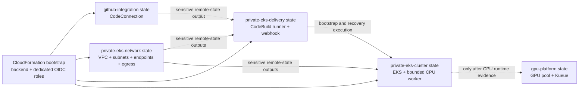

# YY-50 Terraform Structure and GitHub CodeConnections Design

**Status:** Written design for review; no Terraform state, AWS resource, GitHub
connection, or Kubernetes resource is changed by this document.

**Parent work items:** YY-50 private EKS protected runtime validation and the
private-EKS delivery-runner workstream.

## Goal

Restructure the AWS Terraform source into explicit reusable-module, deployable-
foundation, and environment-configuration layers. Use the new layout to add a
repository-scoped AWS CodeConnections integration for the VPC-connected
CodeBuild GitHub Actions runner, then repeat the private-EKS validation path
without assuming that previously tested EKS resources still exist.

The change must preserve existing Terraform state ownership and resource
addresses. It must not combine directory migration, state-key migration, and
runtime deployment in one change.

## Current problem

The current `terraform/envs` directories are independently deployed root
modules rather than environment definitions. Their names mix lifecycle stage,
implementation, and component ownership. This makes it harder to answer:

- which source is reusable;
- which root module owns a state;
- which values belong to sandbox, preview, non-production, or production;
- which dependencies cross state boundaries;
- how a future landing zone or repository split should occur.

The current CodeBuild source-auth discovery also represents the former
account-default model. It correctly proved that no account-level GitHub source
credential exists, but that result does not determine whether a specific
CodeConnections connection is available or suitable for one CodeBuild project.

## Architectural decisions

### 1. Four source layers

The target Terraform tree is:

```text
providers/aws/infra/
├── bootstrap/
│   └── cloudformation/
│       └── github-oidc-terraform-backend.yaml
│
└── terraform/
    ├── modules/
    │   ├── integrations/
    │   │   └── github-codeconnection/
    │   ├── networking/
    │   │   ├── private-network/
    │   │   └── private-egress/
    │   ├── delivery/
    │   │   └── codebuild-github-runner/
    │   ├── compute/
    │   │   ├── eks/
    │   │   └── gpu-kueue/
    │   ├── ai/
    │   │   ├── bedrock-access/
    │   │   └── agentcore-rag/
    │   ├── observability/
    │   │   └── cloudwatch/
    │   └── governance/
    │       └── cost-guardrails/
    │
    ├── foundations/
    │   ├── github-integration/
    │   ├── cost-governance/
    │   ├── private-eks-network/
    │   ├── private-eks-delivery/
    │   ├── private-eks-cluster/
    │   ├── gpu-platform/
    │   ├── bedrock-platform/
    │   └── agentcore-rag-platform/
    │
    └── environments/
        ├── sandbox/
        │   └── ap-southeast-2/
        ├── preview/
        ├── nonprod/
        └── prod/
```

The directories have strict meanings:

| Layer | Purpose | May contain `.tf` | Owns state |
| --- | --- | --- | --- |
| `bootstrap/cloudformation` | Trust roots and Terraform prerequisites | No Terraform | CloudFormation stack only |
| `modules` | Reusable implementation units grouped by technical domain | Yes, child modules | No |
| `foundations` | Deployable Terraform root compositions | Yes, root modules | Yes, one state per foundation invocation |
| `environments` | Deployment configuration and backend location | No | No |

`modules/base` and `modules/capabilities` are not introduced. Domain names such
as `networking`, `delivery`, `compute`, and `ai` communicate ownership more
directly and avoid arguments about whether a module is foundational or a
capability. A module is created only when it provides a useful abstraction or
is reused; single-resource pass-through wrappers are not a target.

### 2. Environment configuration contains values only

Each environment and region contains foundation-specific configuration:

```text
environments/sandbox/ap-southeast-2/
├── github-integration.tfvars.json
├── github-integration.s3.tfbackend
├── private-eks-network.tfvars.json
├── private-eks-network.s3.tfbackend
├── private-eks-delivery.tfvars.json
├── private-eks-delivery.s3.tfbackend
├── private-eks-cluster.tfvars.json
└── private-eks-cluster.s3.tfbackend
```

Rules:

- `.tfvars.json` contains non-secret, reviewable inputs only.
- `.s3.tfbackend` contains backend configuration but no AWS credential.
- credentials, tokens, private keys, and sensitive runtime values never enter
  committed configuration.
- account-specific or sensitive values come from protected GitHub Environment
  values or sensitive remote-state outputs.
- every JSON configuration shape is validated in CI before Terraform runs.
- `preview`, `nonprod`, and `prod` remain documented target environments; empty
  placeholder trees are not created until a real deployment requires them.

### 3. Landing-zone customisation is deferred

No `tenants` directory is created now. If multiple accounts, tenants, or landing
zones later require distinct values, use the unambiguous name
`landing-zones`:

```text
landing-zones/<landing-zone>/<environment>/<region>/<foundation>.tfvars.json
```

Shared foundation code remains unchanged. CI must create or select one resolved
input set; it must not depend on an undocumented deep-merge order between
multiple JSON files.

### 4. GitHub connection is an independent foundation

The connection path is:

```text
GitHub owner
  -> AWS Connector for GitHub installation
  -> one repository-scoped AWS CodeConnection
  -> github-integration Terraform state
  -> sensitive connection ARN output
  -> private-eks-delivery consumes reviewed remote state
  -> CodeBuild project source auth: CODECONNECTIONS
  -> WORKFLOW_JOB_QUEUED webhook
  -> ephemeral runner in private subnets
```

Source locations are:

```text
modules/integrations/github-codeconnection/
foundations/github-integration/
environments/sandbox/ap-southeast-2/github-integration.tfvars.json
```

The connection resource is not placed in the CloudFormation bootstrap stack,
the CodeBuild runner state, or the private-EKS cluster state. CloudFormation
creates only the dedicated GitHub-integration Terraform OIDC role required to
manage this independent state.

A connection created by Terraform is `PENDING`. One GitHub owner must complete
the provider handshake in the AWS console to make it `AVAILABLE`. This is the
only approved interactive exception. Terraform remains the owner of the AWS
connection resource; the console action authorises the third-party installation
and must not be used to create other platform resources.

The GitHub App installation must be limited to `afaryy/cloudai-platform`. Do not
create an account-default CodeBuild credential, import a PAT, or introduce an
OAuth fallback.

### 5. State ownership and dependency direction

The target dependency graph is one-way:



Each foundation owns one backend key. Moving a source directory must not change
its backend key. Existing module-block names and resource addresses remain
unchanged during structural migration. State-key migration, if ever needed, is
a separate future design with its own plan and approval.

The private-delivery Terraform role receives read access only to the exact
GitHub-integration and private-network state objects it consumes. It does not
receive bucket-wide state read access. A sensitive Terraform output prevents
normal CLI display but is not a secrecy boundary for a principal that can read
the state object, so state access remains part of the IAM review.

### 6. IAM boundaries

Four identities remain separate:

| Identity | Responsibility | Must not do |
| --- | --- | --- |
| Bootstrap role | Update trust-root CloudFormation and dedicated Terraform roles | Run workloads or manage Kubernetes |
| GitHub-integration Terraform role | Manage and inspect the named CodeConnection and its isolated state | Manage CodeBuild, VPC, EKS, or import source credentials |
| Private-delivery Terraform role | Read exact dependency states; manage named CodeBuild runner resources | Create/delete connection, VPC, or EKS |
| CodeBuild runtime service role | Run one ephemeral job and use the configured connection | Manage Terraform backend or connection lifecycle |

The CodeBuild runtime role receives only the documented connection operations
required by CodeBuild, scoped to the exact connection ARN. The initial expected
set is `codeconnections:GetConnection` and
`codeconnections:GetConnectionToken`. Wildcard connection resources are not
allowed. Additional connection actions are added only after an exact AWS
authorization failure proves they are required and their resource/condition
scope has been reviewed.

The previously added account-level `codebuild:ListSourceCredentials` permission
is removed after the targeted connection validator is working because the new
design does not rely on account-default credentials.

### 7. Protected workflow model

The GitHub-integration workflow uses explicit modes:

| Mode | AWS access | Behaviour |
| --- | --- | --- |
| `source-validate` | None | Format, validate, native Terraform tests, JSON configuration validation |
| `plan` | Dedicated integration role | Plan only the connection state; retain sanitised change counts |
| `apply` | Dedicated integration role | Fresh no-delete plan and exact confirmation before creating the connection |
| `status-validate` | Dedicated integration role | Verify exact connection provider and status; publish Boolean-only evidence |

`apply` may produce a valid `PENDING` connection; this is not runtime readiness.
After the owner handshake, `status-validate` must prove:

```json
{
  "connection_present": true,
  "provider_is_github": true,
  "connection_available": true,
  "raw_identifiers_published": false
}
```

The private-delivery workflow then validates the exact connection consumed from
remote state. It no longer lists or counts unrelated account-level credentials.
It stops before Terraform plan when the configured connection is missing,
pending, unavailable, from the wrong provider, or in a different region.

Each protected apply keeps a foundation-specific Environment, budget gate,
fresh saved plan, no-delete assertion, and exact confirmation phrase. Shared
source-validation logic may become reusable, but protected lifecycle workflows
remain thin, explicit wrappers rather than one highly parameterised super
workflow.

## Existing-resource inventory gate

The statement that previous EKS resources were destroyed is a hypothesis until
read-only evidence confirms it. Before directory migration or a new apply, CI
must inspect the exact known state keys and expected AWS resource names/tags for:

- the legacy public EKS sandbox;
- private-EKS network foundation;
- VPC-connected private runner;
- private EKS cluster and CPU worker baseline;
- GPU/Kueue POC resources.

The inventory performs no import, refresh-only apply, state remove, or resource
mutation. Public evidence contains only scoped Boolean/count categories, for
example:

```json
{
  "legacy_public_eks_present": false,
  "private_network_present": false,
  "private_runner_present": false,
  "private_eks_present": false,
  "gpu_capacity_present": false,
  "unexpected_scope_detected": false,
  "raw_identifiers_published": false
}
```

If Terraform state and AWS API inventory disagree, stop. Do not recreate,
import, taint, untaint, remove state, or delete resources until the mismatch is
diagnosed and separately approved.

## Migration strategy

Migration is incremental:

1. Record the target layout and source-to-foundation mapping.
2. Add the GitHub integration in the new structure because it has no legacy
   resource address.
3. Create the dedicated integration OIDC role through a reviewed, non-executing
   CloudFormation change set and a separate exact apply approval.
4. Run connection source validation and plan.
5. Apply only the new connection foundation after its exact approval.
6. Complete the single GitHub owner handshake.
7. Validate connection status and repository installation scope.
8. Migrate the private-delivery source into the new layout while preserving its
   original state key, module-block names, and resource addresses.
9. Require a plan with no deletion/replacement caused by the source move.
10. Repeat one existing foundation at a time only after YY-50 runtime evidence
    is complete.

No big-bang runtime deployment or state migration is allowed. Source relocation
is performed in reviewable domain waves, and each wave updates module sources,
workflows, tests, READMEs, architecture-library entries, runbooks, and current-
status records in the same pull request. The existing `envs` tree remains
supported and is labelled legacy during transition, then is removed after every
root composition has moved to `foundations`. Empty placeholders are removed
only when their lack of ownership and references has been proved.

## Existing-source migration inventory

All implemented Terraform modules and roots are in scope. The target mapping is:

| Current path | Target path |
| --- | --- |
| `bootstrap/github-oidc-terraform-backend.yaml` | `bootstrap/cloudformation/github-oidc-terraform-backend.yaml` |
| `modules/bedrock-access` | `modules/ai/bedrock-access` |
| `modules/cost-guardrails` | `modules/governance/cost-guardrails` |
| `modules/eks` | `modules/compute/eks` |
| `modules/eks-gpu-kueue` | `modules/compute/gpu-kueue` |
| `modules/network` | `modules/networking/public-sandbox-network` |
| `modules/private-network` | `modules/networking/private-network` |
| `modules/private-egress` | `modules/networking/private-egress` |
| `modules/private-runner` | `modules/delivery/codebuild-github-runner` |
| `envs/bedrock-sandbox` | `foundations/bedrock-platform` |
| `envs/agentcore-rag-sandbox` | `foundations/agentcore-rag-platform` |
| `envs/cost-guardrails` | `foundations/cost-governance` |
| `envs/eks-sandbox` | `foundations/public-eks-cluster` |
| `envs/eks-private-network` | `foundations/private-eks-network` |
| `envs/eks-private-runner` | `foundations/private-eks-delivery` |
| `envs/eks-private-sandbox` | `foundations/private-eks-cluster` |
| `envs/eks-gpu-kueue-poc` | `foundations/gpu-platform` |

The new CodeConnection has no legacy source path and therefore is not one of
the 17 migration mappings. It is created directly at
`modules/integrations/github-codeconnection` and
`foundations/github-integration`.

Reusable-module dependency lock files are not retained as committed ownership
artifacts. Provider lock files belong to deployable foundations; module tests
may generate transient lock data during CI. The existing empty `api-gateway`,
`cloudwatch`, `dynamodb`, `iam`, `kms`, `lambda`, `s3`, and `secrets` placeholder
directories are removed after reference checks rather than recreated under the
new hierarchy. A real domain module is added only with a real contract and test.

The source migration occurs in these waves:

1. integration module and `github-integration` foundation;
2. networking and delivery modules/foundations required by YY-50;
3. compute modules and public/private EKS foundations;
4. AI and governance modules/foundations;
5. GPU foundation after ordinary CPU delivery remains green;
6. final removal of legacy `envs`, empty placeholders, and obsolete path tests.

Historical implementation-plan documents remain historical records and are not
rewritten to pretend that their original paths were different. Current
architecture, runbooks, indexes, examples, workflows, and executable tests must
point to the new paths. Historical documents receive a short migration note or
redirect when a stale command could otherwise be mistaken for a current
operator instruction.

### State-aware plan parity

A directory move is not always expected to produce a no-op plan because a
previously destroyed or empty state will legitimately plan resource creation.
The migration gate therefore distinguishes two cases:

| Observed state | Required evidence |
| --- | --- |
| State contains deployed resources | Post-move plan is no-op, or contains only an independently approved pre-existing drift correction |
| State is empty or resources were destroyed | Sanitised before/after plan summaries have identical action counts and addresses; no new delete/replacement is introduced by the move |

Raw plans, resource IDs, state, ARNs, subnet IDs, and endpoint values are not
published. The comparison artifact contains only expected addresses, action
categories, parity booleans, and identifier-suppression evidence.

## Validation and test matrix

### Static and contract tests

- Terraform format and validation for every changed foundation and module.
- Native Terraform tests for CodeConnection inputs, output sensitivity, and IAM
  scope.
- JSON parsing and schema validation for every environment file.
- Reject secrets, tokens, private keys, wildcard ARNs, account-default auth, and
  PAT/OAuth configuration in committed values.
- Workflow parsing and exact-mode/confirmation tests.
- Repository tests proving `environments` contains no `.tf` files.
- Repository tests proving child modules contain no backend blocks.

### Migration tests

- Existing backend key is unchanged.
- Existing resource and module addresses are unchanged.
- No source move is accepted with delete or replacement actions.
- Old and new directories cannot both define the same foundation.
- Documentation and workflow paths change in the same pull request.

### Runtime tests

Runtime validation is staged:

```text
read-only existing-resource inventory
  -> connection source validation
  -> connection plan/apply
  -> owner handshake
  -> connection AVAILABLE evidence
  -> private network plan/apply if absent
  -> CodeBuild runner plan/apply
  -> real WORKFLOW_JOB_QUEUED runner smoke
  -> private EKS control plane with CPU desired size zero
  -> endpoint and egress validation
  -> one CPU worker
  -> digest-pinned synthetic CPU workload
  -> metadata-safe evidence
```

ARC, GPU, and Kueue are not part of the first repeated validation. They remain
later phases after the independent CodeBuild runner and ordinary CPU path work
end to end.

## Cost, stop, and teardown boundary

No teardown is executed as part of this design. Before any paid private network
or EKS apply, the existing budget gates remain mandatory and a separate
teardown/stop plan must identify ownership and ordering. Scaling workers to zero
does not stop EKS control-plane, NAT, interface-endpoint, log, or storage costs.

The first runtime exercise is time-boxed. It must record:

- approved monthly ceiling;
- expected fixed and variable services;
- named stop owner;
- validation start and review time;
- resources that continue charging at zero worker capacity;
- the exact later confirmation required before any deletion.

This document does not authorise deletion and does not change the user's current
decision to retain deployed learning resources until a separate teardown review.

## Error handling

- Connection remains `PENDING`: stop before runner plan and complete only the
  owner handshake.
- Wrong GitHub provider or repository scope: stop and correct the connection;
  do not broaden the installation to every repository.
- Missing CodeBuild connection permission: capture the exact denied action and
  add only the minimum ARN-scoped permission through a new review.
- Existing-resource inventory mismatch: stop before state or resource mutation.
- Structural move causes non-empty plan: revert or diagnose the source move;
  do not apply it as a migration shortcut.
- Private runner cannot reach GitHub: inspect NAT/proxy, DNS, TLS, and allowlist
  evidence; do not open the Kubernetes API publicly.
- Runtime smoke succeeds but evidence is missing: readiness remains false.

## Non-goals

- No account-level CodeBuild source credential.
- No PAT, OAuth fallback, or custom token-rotation service.
- No CodePipeline.
- No temporary public EKS API workaround.
- No ARC, GPU, Kueue, HyperPod, or Slurm deployment in the first repeated path.
- No state-key migration or state manipulation during directory migration.
- No employer, customer, production, or sensitive data.

## Completion criteria

The architecture change is complete only when:

1. the target source layers and configuration contracts are implemented;
2. read-only inventory records the actual state of previously tested resources;
3. one repository-scoped CodeConnection is Terraform-owned and `AVAILABLE`;
4. the CodeBuild project consumes that exact connection with ARN-scoped IAM;
5. a real ephemeral CodeBuild GitHub Actions runner job completes inside the
   reviewed VPC boundary;
6. the private-EKS CPU path completes with metadata-safe evidence;
7. documentation distinguishes source implementation, deployed resources, and
   runtime-validated claims;
8. no unapproved delete, replacement, state move, ARC, or GPU action occurred.
